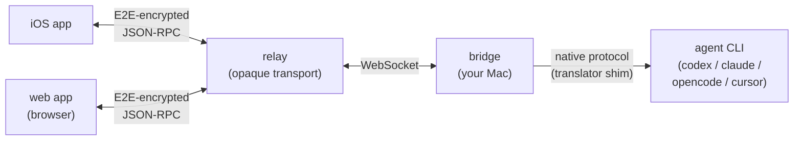

# agnt

[](LICENSE)
[](https://github.com/dotbrains/agnt/actions/workflows/bridge-check.yml)
[](https://github.com/dotbrains/agnt/actions/workflows/build-unsigned-ipa.yml)
[](https://blacksmith.sh)

**Drive coding-agent CLIs from your iPhone or any browser.** agnt is a local-first, source-available bridge that keeps the agent runtime on your Mac or Linux box and proxies an end-to-end encrypted session to your iOS app or to a self-hosted web client. Codex, Claude Code, opencode, and Cursor work today; the provider plugin contract makes it a small change to add another.

## What it is



- **iOS app** and **web app** are two clients of the same protocol — Codex JSON-RPC over a paired secure session.
- **Bridge** runs on your Mac or Linux host. It picks a provider, spawns the matching CLI, and translates between JSON-RPC and whatever native protocol the CLI uses (stream-json, REST+SSE, …). The built-in service installer uses launchd on macOS and systemd-user on Linux; on other operating systems `agnt up` runs in the foreground.
- **Relay** routes ciphertext bytes only. Run it locally for LAN use, or self-host it on a VPS / Tailscale for off-network access.

agnt is a fork of [Remodex](https://github.com/Emanuele-web04/remodex) (Apache-2.0). Remodex was Codex-only; agnt generalizes the transport behind a provider plugin contract so other agents can be added without touching the bridge core.

## Quickstart

```sh
git clone https://github.com/dotbrains/agnt.git
cd agnt
./scripts/run-local-agnt.sh
```

That spins up a local relay + the bridge in the foreground and prints a QR code, the JSON payload, and a short alphanumeric pairing code. Force a specific provider with `--provider codex|claude|opencode|cursor`.

Pair from either client:

- **iOS app** — install [agnt](https://github.com/dotbrains/agnt), scan the QR. The phone reconnects automatically afterward.
- **Browser** — `cd agnt-web && bun install && bun run dev`, open `http://localhost:5173`, then paste the JSON, type the short code, or scan the QR with your camera. Same E2EE handshake. See [`agnt-web/README.md`](agnt-web/README.md) for static-build deployment (Tailscale, VPS, S3+CloudFront, …).

For self-hosting (Tailscale, public VPS, etc.) see [`docs/operations/self-hosting.md`](docs/operations/self-hosting.md).

## Supported providers

| Provider | Status | OS | Notes |
|---|---|---|---|
| **Codex** ([install](https://github.com/openai/codex)) | feature-complete | macOS only | native JSON-RPC; ChatGPT auth + voice + desktop mirror (all bound to `Codex.app`) |
| **Claude Code** ([install](https://docs.claude.com/en/docs/claude-code)) | feature-complete | macOS, Linux | long-lived stdin; plan mode; reasoning deltas; auto-accept edits |
| **opencode** ([install](https://opencode.ai)) | feature-complete | macOS, Linux | runtime tool approvals from your phone; compact + fork |
| **Cursor** ([install](https://cursor.com/docs/cli/installation)) | feature-complete | macOS, Linux | spawn-per-turn; tool calls auto-approved (`--force`) |

Provider deep-dives + capability matrix: [`docs/providers/`](docs/providers/).

## Documentation

The full docset lives in [`docs/`](docs/) with deep technical references and mermaid diagrams.

| Read this if you want to… | Start here |
|---|---|
| understand the architecture | [`docs/architecture/overview.md`](docs/architecture/overview.md) |
| extend agnt with a new provider | [`docs/development/adding-a-provider.md`](docs/development/adding-a-provider.md) |
| self-host on a VPS | [`docs/operations/self-hosting.md`](docs/operations/self-hosting.md) |
| run the browser client | [`agnt-web/README.md`](agnt-web/README.md) |
| diagnose a broken thread | [`docs/operations/debugging.md`](docs/operations/debugging.md) |
| see all `AGNT_*` env vars | [`docs/operations/env-reference.md`](docs/operations/env-reference.md) |

## Configuration

The three you'll actually set:

| Var | Purpose |
|---|---|
| `AGNT_PROVIDER` | force a provider id (`codex` / `claude` / `opencode` / `cursor`) |
| `AGNT_RELAY` | WebSocket relay URL — required when not using `scripts/run-local-agnt.sh` |
| `AGNT_HOME` | override the agnt state directory (default `~/.agnt`) |

The full set (push notifications, APNs, desktop refresher tuning, test overrides) is in [`docs/operations/env-reference.md`](docs/operations/env-reference.md).

## Contributing

Read [`CONTRIBUTING.md`](CONTRIBUTING.md) first. Short version: small focused PRs welcome, contributions ship under [PolyForm Shield 1.0.0](LICENSE) (the same license as the rest of the project), and the playbook for adding a new provider is at [`docs/development/adding-a-provider.md`](docs/development/adding-a-provider.md).

Bridge tests live under `agnt-bridge/test/` (400 unit tests, run with `(cd agnt-bridge && bun run test)`). The CI badges above run on every push.

## License

[PolyForm Shield 1.0.0](LICENSE) — source-available with a non-compete: you may use, copy, modify, and distribute the software, but not to provide a product or service that competes with agnt or with anything dotbrains offers that includes it. Upstream Remodex code retains its original Apache-2.0 grant. See [`legal/TERMS_OF_USE.md`](legal/TERMS_OF_USE.md) for the human-readable summary; `LICENSE` is authoritative.
