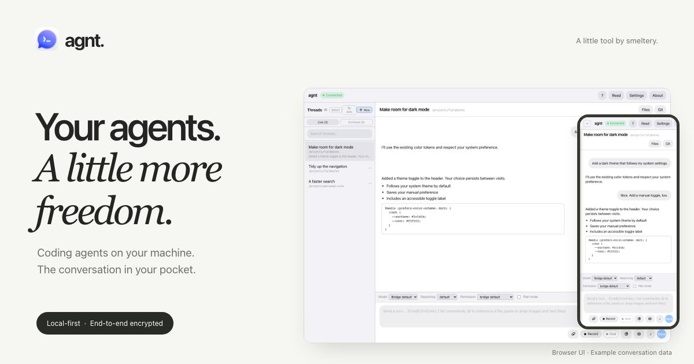

#  agnt



[](https://github.com/smeltery/agnt/actions/workflows/ci.yml)
[](LICENSE)
[](#what-it-is)
[](docs/architecture/overview.md)

[](AgntMobile/)
[](AgntAndroid/)
[](agnt-web/)
[](agnt-web/)
[](agnt-bridge/)
[](agnt-host/src-tauri/)
[](agnt-host/)

**Your coding agents, from your iPhone, Android, or browser.** agnt keeps the agent runtime and repositories on your Mac or Linux machine while you send prompts, follow progress, and review changes remotely.

## What it is

A local-first, source-available bridge between your devices and the coding-agent CLIs you already use. You run the bridge and relay yourself; messages between your client and bridge are end-to-end encrypted, and the relay only routes ciphertext. Your agent’s own model service and data policies still apply.

- Pair with a QR or short code and reconnect to your local sessions.
- Stream responses, queue follow-ups, and use Git actions from your client.
- Keep your existing tools, models, and project directories. Features vary by provider and client.

## Supported providers

| Provider | Host platform |
|---|---|
| Codex | macOS; requires Codex.app |
| Claude Code | macOS, Linux |
| opencode | macOS, Linux |
| Cursor | macOS, Linux |

See the [provider guide](docs/providers/overview.md) for capabilities and configuration.

## Quickstart

Install a supported agent CLI and Node.js/npm on your host, then run:

```sh
git clone https://github.com/smeltery/agnt.git
cd agnt
./scripts/run-local-agnt.sh
```

This starts the local bridge and relay and prints pairing details. Open an agnt client and scan the QR **inside the app**, or enter the pairing code. Keep the host awake and reachable while connected.

Use the [iOS app](docs/architecture/ios-app.md), [Android app](AgntAndroid/README.md) (alpha), or [browser client](agnt-web/README.md). The optional [desktop host](agnt-host/README.md) manages the local processes for you.

For network setup, provider selection, and access away from home, follow the [self-hosting guide](docs/operations/self-hosting.md).

## Documentation

Start with the [documentation index](docs/README.md).

| Topic | Guide |
|---|---|
| Architecture and encryption | [System overview](docs/architecture/overview.md) · [Secure transport](docs/architecture/transport.md) |
| Setup and configuration | [Self-hosting](docs/operations/self-hosting.md) · [Environment variables](docs/operations/env-reference.md) |
| Providers and extensions | [Provider capabilities](docs/providers/overview.md) · [Add a provider](docs/development/adding-a-provider.md) |
| Troubleshooting and development | [Debugging](docs/operations/debugging.md) · [Testing](docs/development/testing.md) · [Contributing](CONTRIBUTING.md) |

The [marketing site](agnt-site/README.md) runs locally with no build step.

## License and attribution

agnt is derived from [Remodex](https://github.com/Emanuele-web04/remodex), created by **Emanuele Di Pietro**. The original [Apache-2.0 license and copyright notice](legal/LICENSE-APACHE-2.0) are preserved; see [NOTICE](NOTICE) for attribution.

[PolyForm Shield 1.0.0](LICENSE): source-available with a non-compete restriction. Inherited Apache-2.0 code retains its original grant. See [terms of use](legal/TERMS_OF_USE.md) for details.
