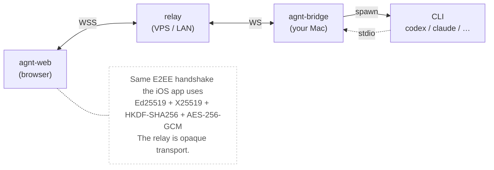

# agnt-web

Browser client for the agnt local-first coding-agent bridge. Pair it once with the
QR/JSON payload your Mac bridge prints, then drive your CLI from anywhere — over
Tailscale, behind a self-hosted relay on a VPS, or just on the same Wi-Fi.

> **Status:** at parity with the iOS app for the everyday-use loop — pairing
> (paste / short code / camera scan), threads + sidebar w/ search + j/k nav,
> kind-aware chat rendering with markdown + Prism syntax highlighting,
> approvals, plan mode, structured user-input prompts, system-notice toasts,
> per-turn flags (model / reasoning / permission / plan), voice transcription,
> image attachments, git panel (status / diff / commit / push / pull / branch /
> worktree), per-turn workspace-checkpoint revert, project picker for new
> chats, settings + about + trusted-Mac mgmt, service worker for offline shell,
> keyboard shortcuts. Pets and StoreKit are explicitly dropped (iOS-specific).
> Bridge-blocked surfaces (`skills/list`, `plugin/list`, `account/rateLimits`,
> `fuzzyFileSearch`) and design-bound work (full Codex OAuth, AI change sets,
> WebPush) are deferred — see [`PARITY.md`](./PARITY.md) and
> [`ROADMAP.md`](./ROADMAP.md).

## Architecture



## Run it locally

The web client is a static SPA. The browser only needs to reach an agnt **relay**,
which forwards opaque ciphertext to your **bridge** (your Mac).

```bash
# Terminal 1 — relay + bridge (uses the existing scripts)
./scripts/run-local-agnt.sh

# Terminal 2 — web client dev server
cd agnt-web
bun install
bun run dev   # http://localhost:5173
```

Pair by pasting the JSON payload your bridge prints under the QR. After the first
successful handshake, the web client trusts that Mac and reconnects automatically
via `/v1/trusted/session/resolve`, so a bridge restart doesn't need a fresh QR.

## Deployment

agnt-web is a static build (`bun run build` → `dist/`). Three common shapes:

### Tailscale + your laptop

Easiest path. Run the bridge + relay on your Mac, expose the relay over Tailscale,
serve `dist/` from the same Mac (e.g. `npx serve dist`). Every device on your tailnet
can pair and connect; nothing is exposed to the public internet.

```bash
# Mac
./scripts/run-local-agnt.sh                           # relay + bridge
cd agnt-web && bun run build && bunx serve dist       # static site
tailscale serve https://<machine>/ proxy 5173         # or however you front it
```

### Self-hosted relay on a VPS

The relay is the only piece that needs a public address. Run it under nginx +
Caddy + Let's Encrypt and give it a DNS name. The bridge connects to that relay
from your Mac (`AGNT_RELAY=wss://relay.example.com`); web users connect to the
same relay from a browser. The bridge does **not** need to be reachable.

```nginx
# /etc/nginx/sites-enabled/agnt
upstream agnt_relay { server 127.0.0.1:9000; }

server {
    server_name relay.example.com;
    listen 443 ssl http2;
    # …let's encrypt cert…

    location /relay/ {
        proxy_pass http://agnt_relay;
        proxy_http_version 1.1;
        proxy_set_header Upgrade $http_upgrade;
        proxy_set_header Connection "upgrade";
        proxy_set_header Host $host;
        proxy_set_header X-Forwarded-For $remote_addr;
        proxy_read_timeout 3600s;
    }
    location /v1/ {
        proxy_pass http://agnt_relay;
        proxy_set_header Host $host;
        proxy_set_header X-Forwarded-For $remote_addr;
    }
    location / {
        root /var/www/agnt-web;
        try_files $uri /index.html;
    }
}
```

Run the relay with `AGNT_TRUST_PROXY=1` so it honors `X-Forwarded-For`.

### Cloudflare Pages / S3 + relay elsewhere

Static hosting works too. The browser will hit whichever relay the pairing
payload points to, so the static origin and the relay don't have to match.

## Security notes

- **Browser key storage is weaker than iOS Keychain.** A malicious browser
  extension or XSS in the same origin could read your phone identity. Serve
  agnt-web from an origin you control and that hosts no other apps. Tailscale,
  a private VPS, or a single-app subdomain are good choices; shared
  collaboration platforms are not.
- **The relay never sees plaintext.** Same as the iOS app: agnt-web encrypts
  every JSON-RPC frame with AES-256-GCM under a key derived from the bridge's
  identity-key signature. The relay can only deny service, not eavesdrop.
- **Trusted-reconnect uses a signed challenge.** The same Ed25519 phone identity
  that authenticated the original QR scan signs every reconnect lookup, so a
  stolen relay record alone can't get someone back into your sessions.

## Development

```bash
bun run dev      # vite dev server
bun run test     # vitest cross-checked against the bridge's secure-transport.js
                 # (use `bun run test`, not `bun test` — the latter invokes
                 # bun's own runner instead of vitest)
bun run lint     # tsc --noEmit
bun run build    # static dist/ for deployment
```

Tests import the sibling `agnt-bridge/src/secure-transport.js` to keep the wire
crypto byte-for-byte aligned. Run them from the repo root or with the prefix:

```bash
npm test --prefix agnt-web
```
