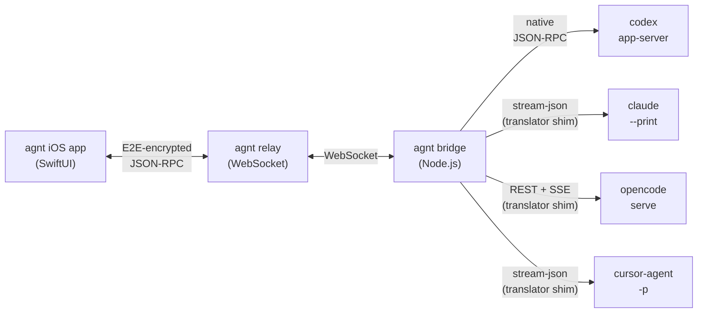

# agnt — Technical Documentation

These docs are aimed at people who want to **extend, debug, or self-host** agnt. If you're just trying to install and run it, the top-level [README](../README.md) and [`operations/self-hosting.md`](operations/self-hosting.md) are enough.

## System at a glance

The iPhone speaks Codex JSON-RPC. The bridge holds a per-connection translator shim per provider that converts that protocol to whatever the upstream CLI actually speaks. The relay only carries encrypted bytes — it cannot read the conversation.

## Where to start

**Contributor onboarding (≈30 minutes):**

1. [`architecture/overview.md`](architecture/overview.md) — processes, files, data flow
2. [`architecture/provider-contract.md`](architecture/provider-contract.md) — what a provider plugin has to implement
3. [`development/adding-a-provider.md`](development/adding-a-provider.md) — worked example

**Debugging an in-prod issue:**

1. [`operations/debugging.md`](operations/debugging.md) — log paths, the `agnt-jsonl-diagnose` CLI, common failures
2. [`operations/env-reference.md`](operations/env-reference.md) — every `AGNT_*` env var
3. [`architecture/transport.md`](architecture/transport.md) — how the wire is encrypted, how reconnect works

**Adding or improving a provider:**

1. [`providers/overview.md`](providers/overview.md) — capability matrix and selection precedence
2. [`architecture/translator-shim.md`](architecture/translator-shim.md) — the `outbound`/`inbound` pattern
3. The matching `providers/<id>.md` deep-dive

## Map

| Area | Read this if you want to know… |
|---|---|
| [`architecture/`](architecture/) | how the bridge is structured, what a provider has to implement, how translation works, how the adaptive turns/list pager makes decisions, how the iOS app is laid out |
| [`providers/`](providers/) | how each supported provider (Codex, Claude Code, opencode, Cursor) is wired in |
| [`operations/`](operations/) | how to self-host, what env vars exist, how to diagnose a broken thread |
| [`development/`](development/) | step-by-step guide for adding a new provider, plus testing conventions |
| [`recaps/`](recaps/) | historical post-mortems and change recaps |

## Conventions in this docset

- **File path + line number** when referencing code, e.g. `agnt-bridge/src/bridge.js:118`. These survive renames better than blob URLs.
- **Mermaid diagrams** for system, sequence, state, and flow visualizations. They render natively on GitHub.
- **Provider-agnostic by default** — when a behavior is Codex-only or Claude-only, it's flagged explicitly. The architecture docs target the bridge core; provider quirks live under [`providers/`](providers/).
- **Code excerpts are illustrative**, not exhaustive. The source is authoritative.
