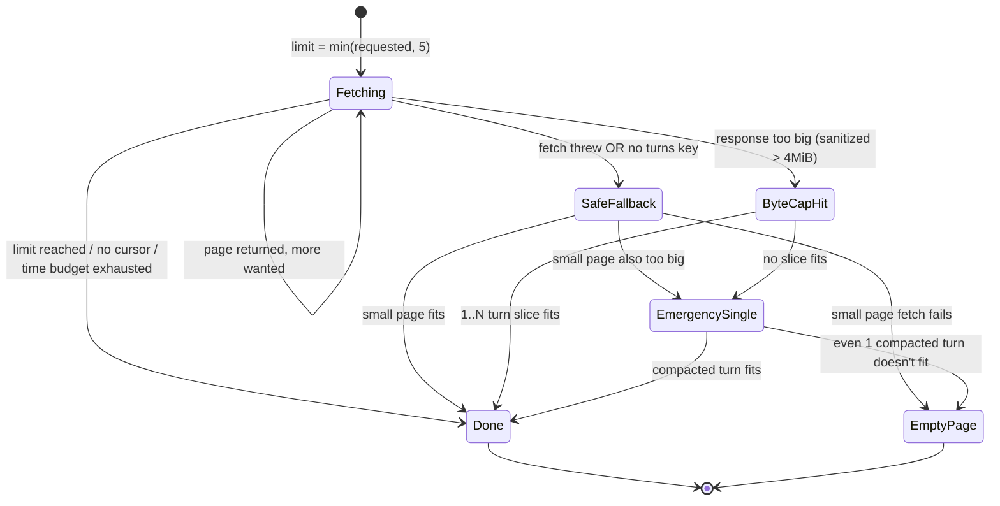
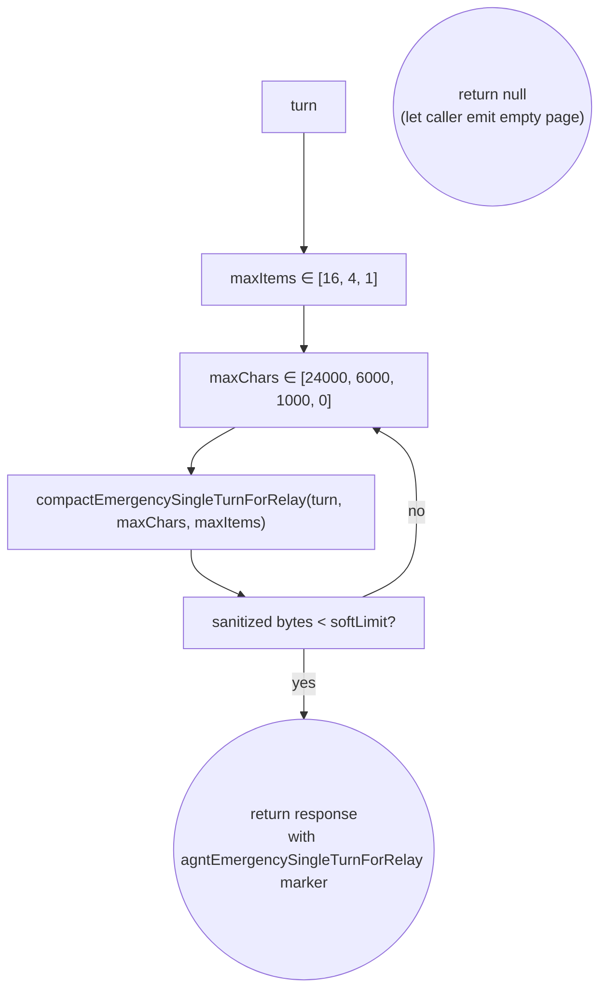
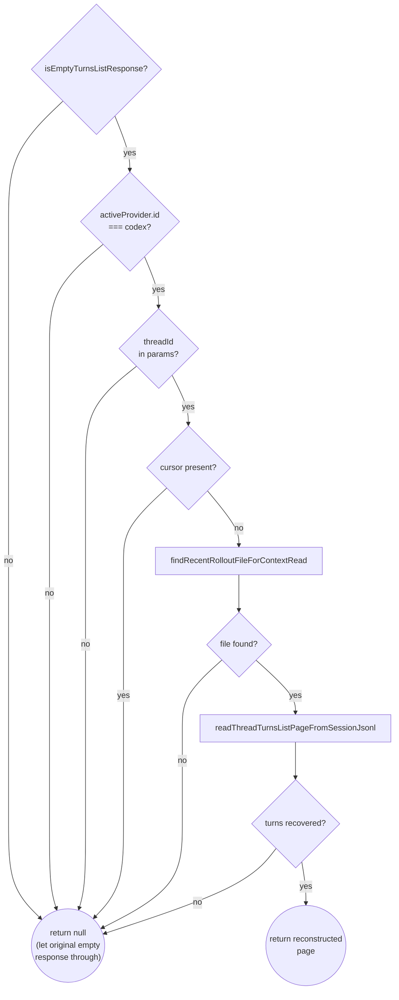

# Adaptive `thread/turns/list` pager

Long Codex chats can have hundreds of turns with multi-megabyte tool outputs. Sending the whole thing through the relay would be slow, expensive, and would sometimes blow past the iOS client's decoding limits. The adaptive pager is the bridge's response to that problem — it serves a deliberately small first page within both **time** and **byte** budgets, and falls back to progressively smaller responses when those budgets are hit.

The implementation lives at module scope in `agnt-bridge/src/bridge.js`, anchored on `fetchAdaptiveThreadTurnsListForRelay()`. It's exercised by 23 unit tests in `test/bridge-relay-helpers.test.js`.

## The two budgets

| Budget | Constant | Default | Why |
|---|---|---|---|
| Time | `RELAY_TURNS_LIST_TARGET_BUDGET_MS` | 5,500 ms | The iPhone has a request-level timeout. We need to return *something* before that fires. |
| Byte (sanitized) | `RELAY_THREAD_PAYLOAD_SOFT_LIMIT_BYTES` | 4 MiB | The iOS decoder bogs down past this. The relay also doesn't like very large frames. |
| Initial page cap | `RELAY_TURNS_LIST_MAX_INITIAL_LIMIT` | 5 | Cap how many turns we even ask the upstream for in one go, so a misbehaving turn can't single-handedly blow the byte budget. |
| Safe-retry cap | `RELAY_TURNS_LIST_SAFE_RETRY_LIMIT` | 5 | Worst-case shrink target before we drop to a single-turn emergency response. |

Time-budget handling existed in agnt prior to the Remodex 1.5.1 port. Byte-cap handling and the emergency single-turn fallback were added in that port. The two limits fire **independently** — whichever trips first wins.

## State machine



Each "Done" state returns `{id, result: {data: turns, nextCursor: ...}}` to iOS. The phone never has to know which fallback path produced the response.

## The normal happy path

Walking through a 3-turn thread that fits comfortably:

1. `requestedLimit = min(params.limit, 5)`. iOS usually asks for 5.
2. Loop: fetch a page (limit = `selectAdaptiveTurnsListBatchLimit(...)` — 1 then 4 then remaining), append turns to `combinedTurns`.
3. After each page, run `unwrapAppServerPayloadResult()` so Codex's nested `{result: {payload: {data}}}` envelope is flattened.
4. After each page, measure: `measureSanitizedTurnsListResponseBytes(response, sanitizeForRelay)`.
5. Stop conditions: enough turns gathered, no `nextCursor`, page returned zero turns, raw page too big, sanitized response too big, page took too long, time-budget remaining ≤ reserve.
6. Return `{id: request.id, result: buildAdaptiveTurnsListResult(...)}`.

## Byte-cap retry path

If the sanitized response exceeds 4 MiB after appending a page, we don't truncate — we **rebuild from scratch** with a smaller slice:

```js
if (measureSanitizedTurnsListResponseBytes(response, sanitizeForRelay) >= payloadSoftLimitBytes) {
  response = buildLargestSafeTurnsListResponse({
    requestId: request.id,
    firstResult, lastResult, turnsKey,
    turns: combinedTurns,
    maxTurns: RELAY_TURNS_LIST_SAFE_RETRY_LIMIT,
    sanitizeForRelay,
    payloadSoftLimitBytes,
  }) ?? buildEmptyTurnsListResponse(request);
  break;
}
```

`buildLargestSafeTurnsListResponse` shrinks progressively: tries 5 turns, then 4, …, down to 1. Whichever count first fits under the byte cap wins.

If even *one* turn doesn't fit (a single turn with a 5 MiB tool output, say), it hands off to the emergency builder.

## Emergency single-turn response

`buildEmergencySingleTurnResponse` is the last-resort. It takes the first turn and runs a nested shrink loop:



`compactEmergencySingleTurnForRelay` only copies whitelisted scalar metadata (id, status, role, …) and slices `turn.items` to the most recent N. It tags the result with `agntEmergencySingleTurnForRelay: true` and `agntPageCompactedForRelay: true` so iOS can render the compacted state explicitly instead of pretending it's a normal response.

If even the most aggressive compaction (1 item, 0-char text) doesn't fit, the builder returns `null` and the caller emits a canonical empty-page response — the phone keeps the thread open instead of crashing.

## JSONL fallback (Codex only)

Separate from the byte-cap and emergency paths: when the upstream returns a syntactically-valid but **empty** result (e.g. transient Codex app-server error, stale upstream cache), `maybeBuildJsonlThreadTurnsListFallback()` reconstructs a small page directly from `~/.codex/sessions/**.jsonl`.



Key gating: this is **Codex-only**. Other providers' translators already synthesize their own `thread/turns/list` from their session files (Claude reads `~/.claude/projects/**.jsonl`, Cursor reads `~/.cursor/chats/*.jsonl`). The fallback short-circuits before any IO when `activeProvider.id !== "codex"`.

The reconstructed page returns up to 5 turns reversed (newest-first) and tags the result with `agntJsonlFallback: true` so iOS can show a "history may be incomplete" indicator if it wants. If the JSONL file has older turns that were trimmed (the parser caps at 5), the response carries `nextCursor: "agnt-jsonl-fallback-older-unavailable"` — a sentinel iOS can treat as "no more pages, we hit the JSONL ceiling."

See [`../providers/codex.md`](../providers/codex.md) for the rollout file format and `agnt-bridge/src/providers/codex/session-jsonl-history.js` for the parser.

## Where each helper lives

All of these are at module scope in `agnt-bridge/src/bridge.js` and exported for testing:

| Helper | Purpose |
|---|---|
| `fetchAdaptiveThreadTurnsListForRelay` | top-level orchestrator |
| `fetchSafeThreadTurnsListFallback` | retry with a small safe-limit page when the normal pager bails |
| `buildSafeTurnsListResponse` | wrap turns into the `{id, result}` envelope |
| `buildLargestSafeTurnsListResponse` | progressive 5→4→…→1 shrink loop |
| `buildEmergencySingleTurnResponse` | last-resort compacted single turn |
| `compactEmergencySingleTurnForRelay` | metadata whitelist + items slice |
| `buildEmptyTurnsListResponse` | canonical empty-page response |
| `isEmptyTurnsListResponse` | predicate over the response shape |
| `maybeBuildJsonlThreadTurnsListFallback` | Codex-only on-disk reconstruction |
| `unwrapAppServerPayloadResult` | flatten Codex `{payload}` nesting |

The full test coverage map is in `agnt-bridge/test/bridge-relay-helpers.test.js`.
