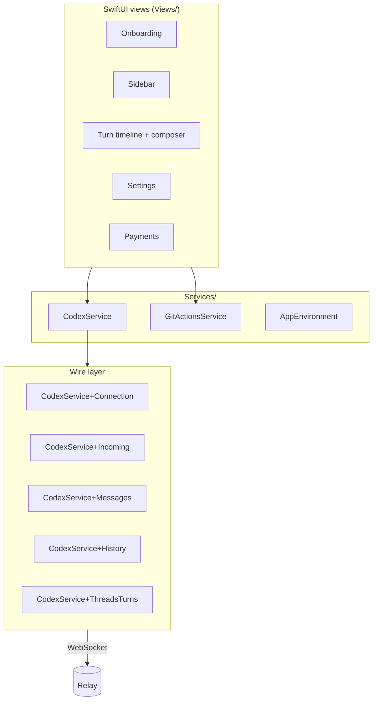

# iOS app architecture (`AgntMobile`)

The iOS app is a SwiftUI project under `AgntMobile/`. It speaks Codex JSON-RPC over the secure transport described in [`transport.md`](transport.md). It does **not** know about providers — that abstraction is entirely on the Mac side.

## Targets

| Target | Purpose |
|---|---|
| `AgntMobile` | the iOS app itself (deploys to iPhone/iPad) |
| `AgntMobileTests` | unit tests for view models, parsing, and message handling |
| `AgntMobileUITests` | UI integration tests |
| `AgntMenuBar` | optional macOS menu-bar companion (separate scheme) |

The Xcode project (`AgntMobile/AgntMobile.xcodeproj`) uses **synced groups**, so adding a Swift file in the right directory is enough — no manual `project.pbxproj` edits needed (this is why our `OpenSourceBadge.swift` → `SourceBadge.swift` rename only required `git mv`).

## Service / view layering

The `CodexService` is implemented as one main class (`CodexService.swift`) plus a stack of extensions in `CodexService+*.swift` files. Each extension owns a slice:

- **`+Connection`** — WebSocket lifecycle, reconnect, secure handshake.
- **`+Incoming`** — JSON-RPC dispatch for all inbound messages.
- **`+Messages`** — per-thread message timeline, streaming merge, persistence (with the `TimelineProjectionLimits` policy).
- **`+History`** — paginated thread history reads.
- **`+ThreadsTurns`** — thread/turn ID bookkeeping.
- **`+Account`** — Codex auth state (only meaningful when `provider === "codex"`).
- **`+Notifications`** — APNs registration + remote notifications.

The class is `@MainActor` for SwiftUI compatibility; methods that talk to the network spawn detached tasks and bridge results back via `await MainActor.run`.

## Threading model

Because everything user-visible runs on the main actor, the timeline merge logic has to be careful:

- Streaming text deltas merge into the **same item id** so a row stays stable across frame ticks.
- Late reasoning deltas merge into existing rows instead of spawning fake "Thinking…" rows.
- Item-aware history reconciliation keeps the timeline coherent across reconnects — the iOS app does not fall back to `turnId`-only matching, because the bridge's `turn/started` may not include a usable `turnId`.

These are the iOS-side guardrails called out in `AGENTS.md`. They're load-bearing — getting them wrong causes timeline flattening or duplicated rows.

## Timeline projection caps

Long chats can have thousands of persisted rows. Two policies in `Services/` bound how much of the backing cache the SwiftUI views project at once:

| Policy enum | File | Caps |
|---|---|---|
| `TimelineProjectionLimits` (private, file-scoped) | `CodexService+Messages.swift` | `rawMessageLimit = 400`, `eagerHydrationMessageLimit = 400` — caps on raw message-list projections |
| `TurnTimelineProjectionPolicy` (internal) | `CodexService+ThreadHistoryPagination.swift` | `initialMessageLimit = 80`, `messagePageSize = 40` — render-window pagination |

These were two enums sharing a name in an earlier draft (a Swift compile error caught during the CI fix from commit `3f60d12`); the rename clarifies that they encode different concerns.

## Composer state

The turn composer (`Views/Turn/TurnComposerView.swift`, `ComposerBottomBar.swift`, `TurnComposerHostView.swift`) carries an `isSending` flag that tracks "the user pressed Send but the bridge hasn't echoed `turn/started` yet." During that window:

- The Send button shows a loading indicator.
- Stop stays visible *once the run is interruptible* — i.e., as soon as `turn/started` arrives with a usable `turnId` or the per-thread fallback resolves one.

## Offline + reconnect

If the WebSocket drops:

- Background disconnect noise (`NWError.posix(.ECONNABORTED)`) is suppressed — these happen routinely on iOS app suspension and are not actionable.
- On foreground recovery, the app re-runs the trusted-handshake path described in [`transport.md`](transport.md). No QR re-scan required.
- The bridge replays unacked messages from its buffer. The phone's last acked sequence number is the resume cursor.

## Environment glue

`AppEnvironment.swift` resolves runtime config from Info.plist + Keychain + Bundle:

- Privacy / Terms URLs (point at GitHub)
- Feedback mailto with optional CLI version (`cliVersion: codex.bridgeInstalledVersion`)
- Subscription configuration (RevenueCat is optional; inert without keys)
- App version summary used in the feedback body

Privacy policy and terms link to `legal/PRIVACY_POLICY.md` and `legal/TERMS_OF_USE.md` on GitHub. Lowercase `legal/` is intentional — GitHub URLs are case-sensitive on the web.

## What the iOS app does NOT do

Worth being explicit, because the boundary matters:

- **No agent CLI on iOS.** The phone never spawns `codex` / `claude` / `opencode` / `cursor-agent`. The bridge owns all of that.
- **No git on iOS.** Git operations are RPC'd to the Mac (`git/*` methods) and executed in the bridge's `git-handler.js`.
- **No file reads beyond images.** Workspace image reads (e.g. for `@file` mentions) go through the bridge's `workspace-handler.js`.
- **No provider-specific UI.** The iOS app reads `thread/initialized` events for tools/skills/slash-commands metadata and renders generically.

This separation keeps the iOS app inspectable and small, and lets adding a new provider be a Mac-side-only change.
