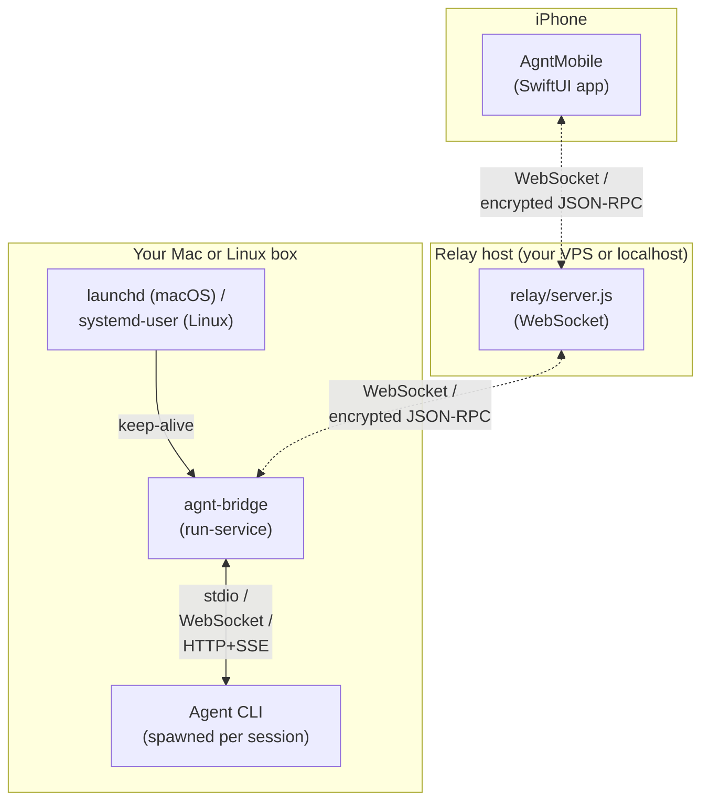
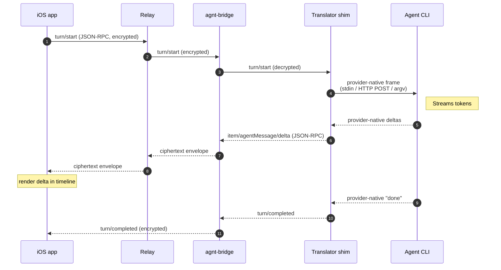

# Architecture overview

agnt is three components running on three machines:

| Where | What | Lang | Source |
|---|---|---|---|
| Phone | iOS app (`AgntMobile`) | SwiftUI | `AgntMobile/` |
| Mac or Linux | Bridge daemon (`@smeltery/agnt`) | Node.js (CommonJS) | `agnt-bridge/` |
| Mac, Linux (or your VPS) | Relay (`agnt-relay`) | Node.js | `relay/` |

Plus whichever **agent CLI** you've configured a provider for: `codex`, `claude`, `opencode`, or `cursor-agent`. The agent CLI is a separate process spawned (or spoken to) by the bridge.

## Process model



- **iOS app** never speaks to the agent CLI directly. It only speaks Codex JSON-RPC, on top of an end-to-end encrypted secure transport.
- **Relay** is a dumb message switch. It sees connection metadata and ciphertext envelopes, never plaintext.
- **Bridge** is the brain. It owns provider selection, the translator shim per provider, the secure transport, the adaptive pager, and all session state on the host.
- **Agent CLI** runs on the host (Mac or Linux) with full filesystem access. The user owns it and the credentials it uses.

## Repository layout

```
agnt/
├── agnt-bridge/                          # Node.js bridge package
│   ├── bin/
│   │   ├── agnt.js                       # CLI entrypoint (`agnt up` / `run-service` / etc.)
│   │   └── agnt-jsonl-diagnose.js        # Debug tool for Codex rollout files
│   └── src/
│       ├── bridge.js                     # Provider-agnostic core
│       ├── secure-transport.js           # E2E-encrypted relay framing
│       ├── macos-launch-agent.js         # launchd plist + lifecycle helpers (macOS)
│       ├── linux-systemd-agent.js        # systemd-user unit + lifecycle helpers (Linux)
│       ├── git-handler.js                # Local git ops triggered from phone
│       ├── workspace-handler.js          # cwd + workspace metadata
│       ├── session-state.js              # ~/.agnt/ persistence
│       ├── rollout-watch.js              # Codex rollout file tailing
│       ├── rollout-live-mirror.js        # Codex desktop-companion mirror
│       └── providers/
│           ├── types.js                  # defineProvider, capabilities, withTranslator
│           ├── index.js                  # Registry + resolveActiveProvider
│           ├── codex/                    # Native (no translator)
│           ├── claude/                   # stream-json shim
│           ├── opencode/                 # REST + SSE shim
│           └── cursor/                   # spawn-per-turn stream-json shim
├── AgntMobile/                           # iOS app (Xcode project)
├── relay/                                # Local relay server (single file)
├── docs/                                 # You are here
├── legal/                                # Privacy + Terms
└── scripts/run-local-agnt.sh             # Launcher that ties relay + bridge together
```

For the bridge's own internal layering, see [`provider-contract.md`](provider-contract.md). For how the iOS app is structured, see [`ios-app.md`](ios-app.md).

## End-to-end turn lifecycle

The single most important sequence to internalize: what happens when the user types a message on the phone and gets a streaming response.



Codex is the only provider where the "translator shim" is a no-op — its CLI already speaks Codex JSON-RPC. For everything else, see [`translator-shim.md`](translator-shim.md).

## Layering rules

The bridge core is **agent-agnostic**. Provider-specific logic lives only in `providers/<id>/`. These rules from `AGENTS.md` are load-bearing:

- `bridge.js` may not directly import `codex-transport`, `CodexDesktopRefresher`, or any other provider-specific module. It must go through `resolveActiveProvider()` and capability flags.
- When a capability is absent (e.g. `desktopRefresher: false`, `rolloutMirror: false`), gate the codepath on `provider.capabilities.<flag>` and degrade gracefully — don't crash, don't silently break.
- Provider selection precedence: `--provider <id>` flag → `AGNT_PROVIDER` env → persisted daemon-state → first registered provider whose `isInstalled()` returns true → first registered provider.
- All env names start with `AGNT_*`. Reads go through `readFirstDefinedEnv([...])` so adding a future legitimate alias stays a one-line edit.

## What lives where

If you're trying to find code, this table maps common questions to entry points:

| "I want to understand…" | Start here |
|---|---|
| how a turn flows end-to-end | [`translator-shim.md`](translator-shim.md) + claude/cursor `translate.js` |
| how `thread/turns/list` decides what to send | [`adaptive-pager.md`](adaptive-pager.md) |
| how the QR pairing handshake works | [`transport.md`](transport.md) |
| what a provider has to implement | [`provider-contract.md`](provider-contract.md) |
| how the bridge daemon survives Mac restarts | `agnt-bridge/src/macos-launch-agent.js` |
| how reconnect/replay work | `agnt-bridge/src/secure-transport.js` |
| how Codex's terminal app gets mirrored | `agnt-bridge/src/rollout-live-mirror.js` (Codex-only) |
| how iOS renders the conversation | [`ios-app.md`](ios-app.md) |
