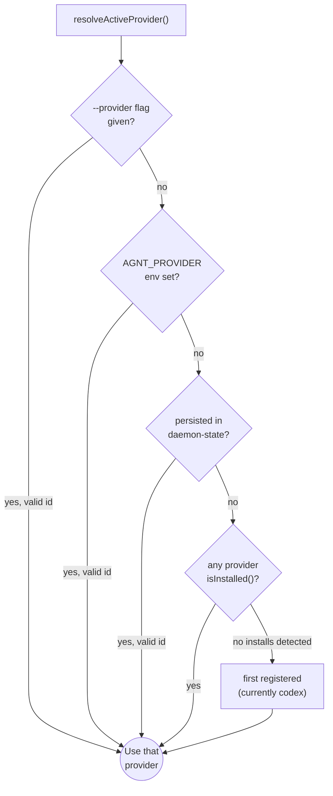

# The provider plugin contract

Every supported agent CLI is wired in through a **provider module** that conforms to a small contract defined in `agnt-bridge/src/providers/types.js`. The bridge core is agent-agnostic and goes through this contract for everything: spawning the CLI, translating messages, surfacing capabilities, locating session files, and bootstrapping installs.

## The shape

```js
defineProvider({
  // Identity
  id: "claude",                    // string, lowercased, stable
  displayName: "Claude Code",      // human label

  // Discovery
  binCandidates: ["claude"],       // names to look up the binary
  isInstalled({ env }) { ... },    // boolean — used by auto-detect

  // Filesystem
  homeDir() { ... },               // ~/.claude
  sessionsDir() { ... },           // ~/.claude/projects

  // Capability flags (see below)
  capabilities: { ... },

  // Behavior
  createTransport(opts) { ... },   // returns ProviderTransport
  createTranslator(ctx) { ... },   // optional — protocol shim

  // Optional hooks
  bootstrap({ env, logger }) { ... },           // postinstall
  createDesktopRefresher(opts) { ... },         // companion-app mirror (Codex only today)
  parseRolloutLine(line) { ... },               // rollout-watcher hook (Codex only today)
});
```

Everything is validated by `validateProviderModule()` at registration time so a misconfigured provider fails fast instead of crashing the bridge mid-turn.

## Required vs optional fields

| Field | Required | Purpose |
|---|---|---|
| `id`, `displayName` | yes | identity surfaced to logs and the iOS UI |
| `homeDir()`, `sessionsDir()` | yes | filesystem locations the bridge reads/writes |
| `capabilities` | yes | gates codepaths in the bridge core |
| `createTransport(opts)` | yes | spawn / connect to the CLI; returns a `ProviderTransport` |
| `createTranslator(ctx)` | conditional | required if the CLI doesn't speak Codex JSON-RPC natively |
| `binCandidates` | optional | hint for `detect*Binary()` helpers in `<id>/detect.js` |
| `isInstalled({env})` | optional | enables auto-detect during `resolveActiveProvider()` |
| `bootstrap({env, logger})` | optional | postinstall hook (`@dotbrains/agnt`'s `postinstall` calls every provider's bootstrap) |
| `createDesktopRefresher(opts)` | optional | only relevant for `capabilities.desktopRefresher === true` |
| `parseRolloutLine(line)` | optional | only relevant for `capabilities.rolloutMirror === true` |

## Capability flags

Defined in `PROVIDER_CAPABILITY_KEYS` in `types.js`. Each flag answers "should the bridge core run this codepath at all?" — the iOS app and bridge both gate features on these.

| Flag | True when | Affects |
|---|---|---|
| `plan` | provider has structured plan-mode | iOS plan UI, `--permission-mode plan` flag |
| `fastMode` | provider has a low-latency turn variant | iOS fast-mode toggle |
| `subagents` | provider supports `/subagents` | iOS subagents picker |
| `steerActiveTurn` | provider supports mid-turn steering | iOS steer button |
| `queueFollowup` | provider can queue a prompt while a turn is active | iOS pre-send during active turn |
| `reasoningDeltas` | provider emits separate reasoning frames | iOS "Thinking…" rendering |
| `desktopRefresher` | provider has a companion desktop app to nudge | bridge's debounced refresh path |
| `rolloutMirror` | provider exposes on-disk session/rollout files | bridge's rollout-live-mirror watcher |

**Today's matrix:**

| Provider | plan | fastMode | subagents | steer | queue | reasoning | refresher | mirror |
|---|---|---|---|---|---|---|---|---|
| `codex` | ✓ | ✓ | ✓ | ✓ | ✓ | ✓ | ✓ | ✓ |
| `claude` | ✓ | ✗ | ✓ | ✗ | ✗ | ✓ | ✗ | ✗ |
| `opencode` | ✗ | ✗ | ✗ | ✗ | ✗ | ✓ | ✗ | ✗ |
| `cursor` | ✗ | ✗ | ✗ | ✗ | ✗ | ✗ | ✗ | ✗ |

`rolloutMirror: true` is **Codex-only** because the rollout watcher knows how to parse Codex's rollout schema. Until a normalized cross-provider parser exists, other providers keep this off.

## ProviderTransport interface

What `createTransport(opts)` must return:

```js
{
  mode: "spawn" | "websocket" | "http",
  describe(): string,                     // human label for logs

  send(message: string): void,            // outbound bridge → CLI
  onMessage(handler: (line) => void): void,
  onClose(handler: (info) => void): void,
  onError(handler: (err) => void): void,
  onStarted(handler: (info) => void): void,
  shutdown(): void,

  // Optional, used by translator shims:
  setTurnArgs(args: string[]): void,      // per-turn CLI flags (model, effort, plan)
  setResumeSessionId(id: string): void,   // for --resume on respawn
  setCwd(cwd: string): void,              // working directory updates
  interruptTurn(): void,                  // soft-interrupt current turn
}
```

The exact set of optional methods depends on what the translator needs. A native provider (Codex) won't define any of them.

## ProviderTranslator interface

When the CLI doesn't speak Codex JSON-RPC, you provide a translator. The factory is invoked **once per bridge connection**, so it's the right place to hold per-connection state (threadId↔sessionId maps, in-flight turn tracking, etc.):

```js
createTranslator(ctx) {
  // ctx.injectInbound(line)  — synthesize a JSON-RPC line into the bridge
  //                            as if it had arrived from the CLI
  // ctx.transport            — the raw transport instance
  // ctx.env                  — process env

  return {
    outbound(line) { ... },       // bridge → CLI; return null|string|string[]
    inbound(line) { ... },        // CLI → bridge; return null|string|string[]
    handleStarted(info) { ... },  // optional
    handleClose(info) { ... },    // optional
  };
}
```

Translation directions:

- **outbound**: bridge JSON-RPC → provider-native frames. The translator may emit zero, one, or many frames per line, or use `ctx.injectInbound()` to answer locally without ever touching the CLI (e.g. synthesizing a `thread/start` response with a placeholder `threadId`).
- **inbound**: provider-native frames → bridge JSON-RPC. Returns the same `null | string | string[]` semantics.

`withTranslator(transport, provider)` in `types.js` wraps the raw transport in a thin proxy that pipes outbound `send()` and incoming `onMessage` through the translator. Bridge core code never sees provider-native frames.

For the patterns each provider uses, see [`translator-shim.md`](translator-shim.md) and the provider deep-dives under [`../providers/`](../providers/).

## Provider resolution



Source: `agnt-bridge/src/providers/index.js`. Source order in `PROVIDERS = [codex, claude, opencode, cursor]` decides the "first registered" fallback.

## Adding a new provider

The step-by-step playbook lives in [`../development/adding-a-provider.md`](../development/adding-a-provider.md). The short version:

1. Create `agnt-bridge/src/providers/<id>/index.js` exporting `defineProvider({...})`.
2. Implement `createTransport()` and (if the CLI doesn't speak Codex JSON-RPC) `createTranslator()`.
3. Register the module in `agnt-bridge/src/providers/index.js`.
4. Set capabilities accurately — `false` is always safe; `true` requires real implementation.
5. Add tests in `agnt-bridge/test/<id>-translate.test.js` (cursor's tests are a good template).
