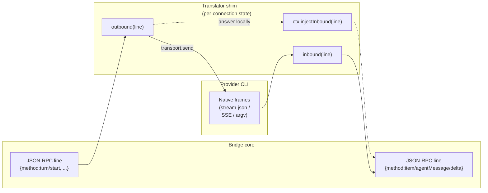
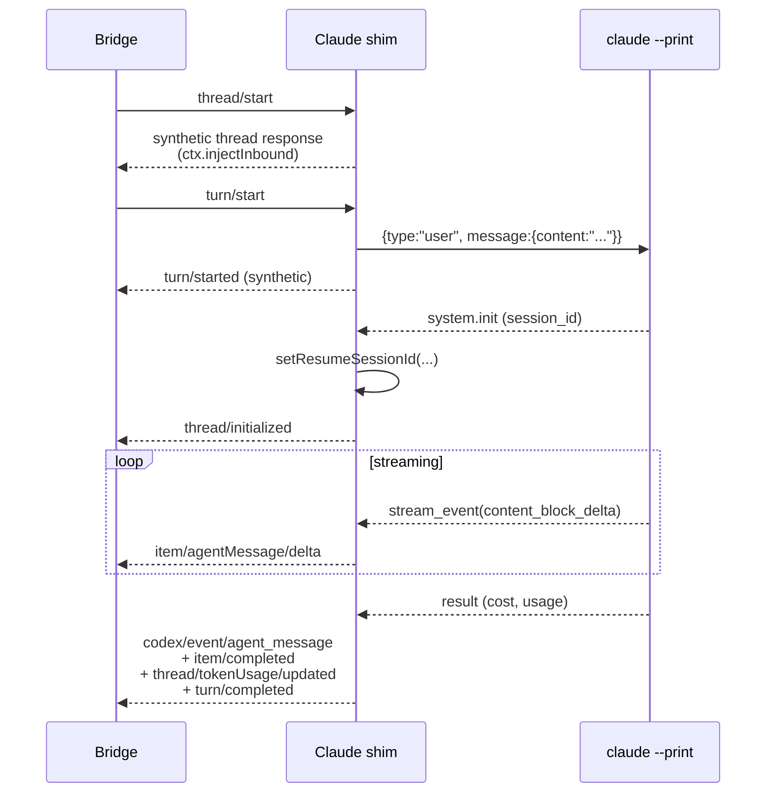
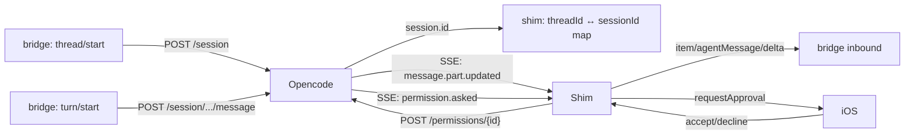
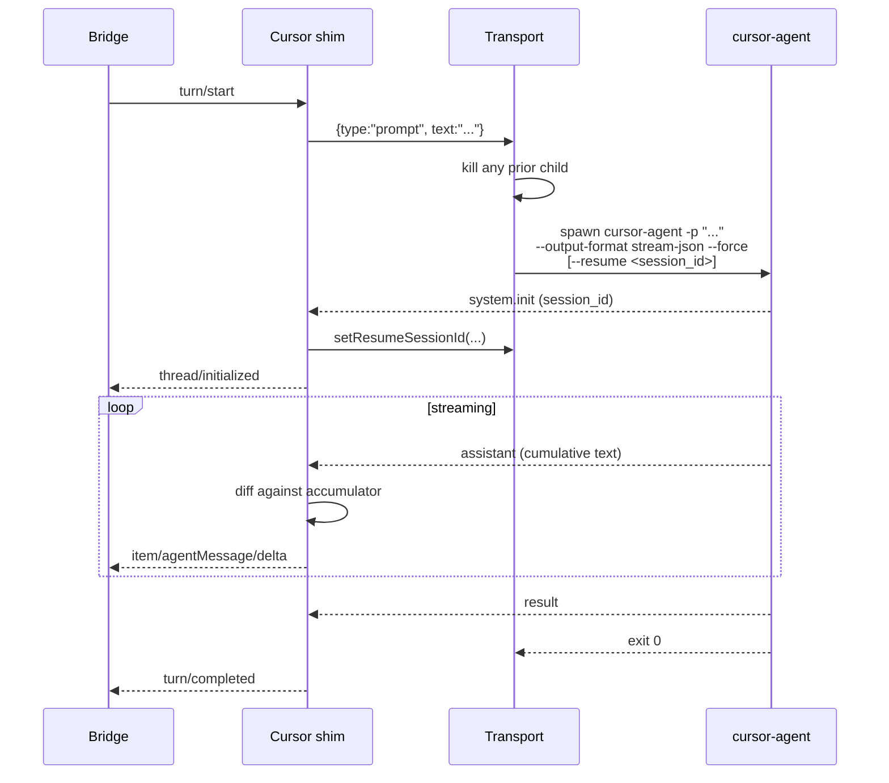

# Translator shims

A translator shim sits between the bridge core (which speaks Codex JSON-RPC) and a provider whose CLI speaks something else. Today three providers use shims: `claude` (stream-json), `opencode` (REST + SSE), `cursor` (stream-json, spawn-per-turn). Codex is native — no shim.

The shim is the most subtle piece of the bridge. This page covers the contract and the three patterns the existing shims demonstrate.

## What a shim does, conceptually



Three things to internalize:

1. **outbound** is "what does the bridge want to tell the CLI?" — the shim converts JSON-RPC into native frames and writes them.
2. **inbound** is "what did the CLI just say?" — the shim converts native frames back into JSON-RPC notifications/responses.
3. **`ctx.injectInbound()`** lets the shim *answer the bridge locally* without ever touching the CLI. This is how every shim handles requests like `thread/start` — the underlying CLI doesn't know what "threads" are, so the shim synthesizes a thread id and replies with a fake response.

## The wrap that wires it together

`withTranslator(transport, provider)` in `agnt-bridge/src/providers/types.js` does the plumbing. Pseudocode:

```js
function withTranslator(transport, provider) {
  const translator = provider.createTranslator({
    injectInbound(line) { /* push to onMessage handler as if from CLI */ },
    transport,
    env: process.env,
  });

  return {
    ...transport,
    send(message) {
      const frames = translator.outbound(message);
      for (const frame of [].concat(frames || [])) {
        transport.send(frame);
      }
    },
    onMessage(handler) {
      transport.onMessage((line) => {
        const frames = translator.inbound(line);
        for (const frame of [].concat(frames || [])) {
          handler(frame);
        }
      });
    },
  };
}
```

That's the whole adapter. Each `outbound`/`inbound` call may return `null` (drop), a single string (forward), or an array (split into multiple frames). Translator errors are caught and logged so a buggy shim doesn't crash the bridge.

## Pattern A — long-lived stdin (Claude)

Claude's CLI accepts `{type:"user", message:{...}}` lines on stdin and emits `{type:"system|assistant|user|result|stream_event"}` lines on stdout. One process handles many turns. The translator state machine:



Three implementation details to know:

- **Per-turn flags via `setTurnArgs()`.** When iOS picks a model or effort level on `turn/start`, the shim translates the params into `["--model", "X", "--permission-mode", "Y"]` and publishes them to the transport. If the args change while the CLI is running, the transport restarts the CLI with `--resume <session_id>` to keep history. See `agnt-bridge/src/providers/claude/translate.js`.
- **Soft interrupt.** `turn/interrupt` calls `transport.interruptTurn()` which `SIGINT`s the child. The next `send()` respawns transparently.
- **Approvals.** Claude has no runtime approval channel in `--print` mode. The shim hard-codes `--permission-mode acceptEdits` as the default so file-edit tool calls don't block forever; iOS can override per turn via `params.permissionMode`.

## Pattern B — REST + SSE (opencode)

opencode is a local HTTP server you `POST` to. State lives in opencode itself; the shim mostly forwards.



Key behaviors:

- **Approvals are real-time.** opencode's SSE `permission.asked` event becomes an `item/commandExecution/requestApproval` (or `item/fileChange/requestApproval`) JSON-RPC request to iOS. The phone replies `{decision: "accept"|"decline"}` and the shim POSTs `response: "once"|"reject"` to `/session/{id}/permissions/{permissionID}`.
- **Toasts surface as system notices.** opencode's `tui.toast.show` SSE event becomes a `system/notice` JSON-RPC notification so MCP-auth warnings and similar surface in iOS instead of being dropped silently.
- **Session continuity.** The shim maps the bridge-side `threadId` to opencode's `session.id`. On reconnect, the shim re-fetches existing messages so iOS history stays consistent.

See `agnt-bridge/src/providers/opencode/translate.js`.

## Pattern C — spawn-per-turn (Cursor)

`cursor-agent` doesn't accept stdin frames for prompts — the user message must be a CLI argument. Each turn is a fresh process:



Why spawn-per-turn instead of long-lived: `cursor-agent --print` accepts the prompt as a positional CLI arg only. There's no stdin frame protocol. So each `turn/start`:

1. Translator emits `{type:"prompt", text}` to the transport — a custom envelope it knows how to handle.
2. Transport SIGTERMs any prior child, then spawns a fresh `cursor-agent` with the prompt as argv plus `--resume <session_id>` if known.
3. After the `result` line, the child exits.

Continuity comes from `--resume`. The shim mirrors the `session_id` from every incoming frame to `transport.setResumeSessionId()` so the next spawn picks up history.

See `agnt-bridge/src/providers/cursor/{translate,transport}.js`.

## Synthesizing JSON-RPC responses locally

A recurring need: the bridge sends a `thread/start` request, but the underlying CLI doesn't have a "create thread" RPC. The shim can answer locally:

```js
function outbound(line) {
  const parsed = JSON.parse(line);
  if (parsed.method === "thread/start") {
    const threadId = `thr_${crypto.randomBytes(12).toString("hex")}`;
    injectInbound(JSON.stringify({
      id: parsed.id,
      result: { thread: { id: threadId, ... } },
    }));
    injectInbound(JSON.stringify({
      method: "thread/started",
      params: { threadId, ... },
    }));
    return null;  // never touches the CLI
  }
  // ...other methods
}
```

This pattern is used by every shim for `thread/start`, `thread/read`, `thread/turns/list`, `thread/list`, `thread/generateTitle`, `thread/contextWindow/read`, and `thread/compact`. Some of those (`thread/turns/list`, `thread/list`) actually walk the provider's session files on disk to reconstruct history.

## Concurrent-turn safety

The Claude, opencode, and Cursor shims all reject a second `turn/start` while one is in flight, with JSON-RPC error code `-32003`. iOS UI normally disables the Send button during an active turn, but this is the backstop against reconnect races where two `turn/start`s arrive on the wire close together.

```js
if (activeTurnId) {
  respondError(request?.id, -32003, "A turn is already in flight on this thread");
  return null;
}
```

Codex doesn't need this guard because the upstream `app-server` enforces it natively.
