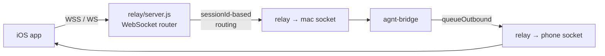
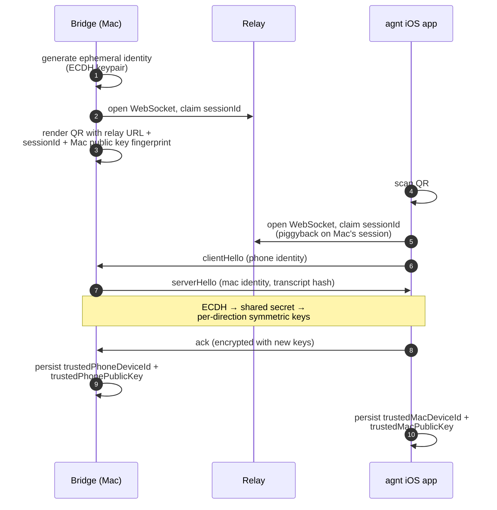
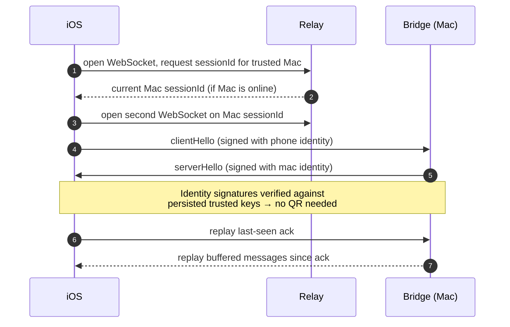

# Transport, pairing, and the secure channel

The wire between iOS and the bridge has three layers stacked on each other:

1. **WebSocket to a relay** — provides ordering and presence, nothing else.
2. **Secure session** — ECDH-derived key + authenticated framing, established once via QR scan and remembered as a trusted pair.
3. **Codex JSON-RPC** — the application-level protocol the iOS app speaks.

The relay can see (1) but not (2) or (3). If you're running your own relay (`relay/server.js`), you're transporting opaque ciphertext.

## Relay topology

The relay routes by `sessionId` only. Every payload is an encrypted envelope after the initial handshake. The relay code in `relay/server.js` is intentionally small for inspection.

## Pairing handshake (QR bootstrap)

After this point, the QR is no longer needed. Both sides remember each other and re-derive session keys via ECDH on every reconnect.

## Reconnect (no QR)

When the iPhone or Mac comes back from sleep, lost network, or a relaunch, neither side wants to bother the user. The reconnect path:

The relay maintains a **buffered message queue** per session so a momentary disconnect doesn't lose tokens. The iOS client tracks the last-acked sequence number; the bridge replays from that point on rebind.

Implementation lives in `agnt-bridge/src/secure-transport.js`. The bridge logs handshake events with redacted identifiers (per the source-available safety guardrail — never log live `sessionId` values in plaintext).

## Sequence-number guarantees

Inside a secure session:

- Every outbound payload is sequenced and authenticated.
- `queueOutboundApplicationMessage()` is the only way bridge code emits anything. It enforces ordering and triggers replay on rebind.
- `recordAckedOutboundSequence(seq)` retires buffered messages once the phone has acked them. The relay's per-session memory grows only with unacked traffic.

## Lifecycle on macOS

The bridge is normally run as a launchd `LaunchAgent`. The plist is generated at runtime by `macos-launch-agent.js` and pointed at `node bin/agnt.js run-service`. On `agnt up`:

1. `writeDaemonConfig()` persists the relay URL and provider id.
2. `clearPairingSession()` + `clearBridgeStatus()` wipe stale state.
3. `writeLaunchAgentPlist()` regenerates the plist.
4. `restartLaunchAgent()` `bootout`s the old job (if any) and `bootstrap`s the new one.

Stop is the inverse — `stopMacOSBridgeService()` also reads the recorded PID from `bridge-status.json` and `SIGTERM`s any orphan `agnt run-service` left behind by a crashed bootout. Verification via `ps -p <pid> -o command=` matching both `agnt` and `run-service` ensures we never kill an unrelated reused PID.

See `agnt-bridge/test/macos-launch-agent.test.js` for the orphan-cleanup contract — that's the quickest way to read the intended behavior.

## What the relay sees

If you're inspecting traffic on a self-hosted relay, you'll see:

- WebSocket frames with binary payloads.
- A `sessionId` per pairing (looks like `session-…` — these are bearer tokens; **never** log them).
- Connection metadata (IP, user-agent, timestamps).
- No plaintext prompts, responses, model names, file paths, or command output.

If you do want to debug *inside* the secure session, you have to do it on the bridge side — that's where plaintext exists.

## Observed thread activity

Clients can opt into compact activity metadata with `agnt/activity/subscribe`
and `{ "schemaVersion": 1 }`. The response contains an epoch, revision, and entries
for observed threads; it is not a complete thread catalog. Subsequent
`agnt/activity/updated` notifications carry coalesced revision updates. Subscribe
again after reconnect or a revision gap, and use `agnt/activity/unsubscribe` when
updates are no longer needed. The feed preserves runtime ownership and marks a
lost Desktop connection stale without inventing a terminal outcome. It uses the
same encrypted transport as other application messages.
