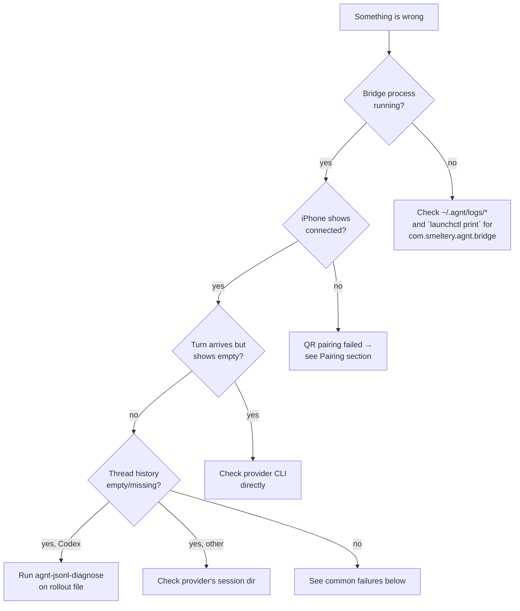

# Debugging

When something on agnt isn't working — empty thread history, a hanging turn, the bridge won't start — this is the page that walks you through where to look first.

## Decision tree



## Log paths

| File | What's there |
|---|---|
| `~/.agnt/logs/bridge.stdout.log` | normal bridge output |
| `~/.agnt/logs/bridge.stderr.log` | bridge errors and provider stderr |
| `~/.agnt/bridge-status.json` | current daemon status snapshot |
| `~/.agnt/daemon.json` | persisted launchd config (provider id, relay URL) |
| `~/.agnt/pairing.json` | active pairing session (deleted after stop) |

The bridge redacts live `sessionId` values and other bearer-like identifiers in logs (per the source-available safety guardrail). If a log line has a redacted token, that's not a bug.

## Inspect the launch agent state (macOS)

```sh
# What does launchd think is happening?
launchctl print "gui/$UID/com.smeltery.agnt.bridge"

# Tail bridge logs
tail -f ~/.agnt/logs/bridge.stdout.log ~/.agnt/logs/bridge.stderr.log

# Force a clean restart
agnt down && agnt up
```

If the launchd job is missing but a stale `agnt run-service` is still alive (rare — usually a crashed bootout), `agnt down` now SIGTERMs it via the orphan-cleanup path that ships in 0.1.x+ (see `agnt-bridge/src/macos-launch-agent.js` `terminateRecordedBridgeProcess`).

## `agnt-jsonl-diagnose` — for empty Codex `thread/turns/list`

If a Codex thread shows no history on the phone but you know the conversation existed, the rollout file is your source of truth:

```sh
# Find recent rollouts
ls -lt ~/.codex/sessions/ | head -10

# Inspect one
npx agnt-jsonl-diagnose ~/.codex/sessions/<session>.jsonl

# More detail:
npx agnt-jsonl-diagnose ~/.codex/sessions/<session>.jsonl --recent-turns 10 --show-text
```

The CLI prints structured JSON with:

- File-level stats (line count, byte size, parse errors).
- Recovered turn count + per-turn item shapes.
- The most recent N turns with optional text previews.

Exit codes:

- `0` — file looks healthy (turns recovered, no parse errors).
- `2` — file not readable.
- `3` — parse errors or zero turns recovered (likely the issue).

This tool is **Codex-only**. Other providers store sessions in their own schemas — Claude under `~/.claude/projects/`, opencode under `<XDG_DATA_HOME>/opencode/sessions/`, Cursor under `~/.cursor/chats/`. Walk those manually with `cat` + `jq` for those.

The bridge already runs a fallback path internally — see [`../architecture/adaptive-pager.md#jsonl-fallback-codex-only`](../architecture/adaptive-pager.md). The diagnostic CLI is for cases where that fallback also returned nothing.

## Common failures

### "No relay URL configured"

The bridge was started without `AGNT_RELAY` set and not via `scripts/run-local-agnt.sh`. Either:

```sh
AGNT_RELAY="ws://localhost:9000/relay" npm start
# OR
./scripts/run-local-agnt.sh
```

### "claude/cursor/opencode CLI not found"

The provider's `isInstalled()` returned false. Either:

- Install the missing CLI (the bridge prints the install command).
- Force a different provider: `agnt up --provider codex`.
- Set the provider-specific override env var (`CLAUDE_CLI_PATH`, `CURSOR_CLI_PATH`, …).

### Pairing fails / QR scan loops

```sh
# Wipe pairing state on the Mac
rm ~/.agnt/pairing.json ~/.agnt/secure-device-state/*

# Restart the bridge (regenerates Mac identity)
agnt down && agnt up
```

On the iPhone, delete and re-add the trusted Mac in Settings, then re-scan the QR.

### Turn hangs forever in the iOS UI

Most likely the upstream agent hung. The bridge can't always tell. Try:

- Tap Stop in the iOS UI — every shim emits synthetic `turn/failed` + `turn/completed` so the UI exits the spinner. If Stop doesn't recover, the iPhone has lost track of the turn id; force-close and reopen the app.
- Check the agent's own logs:
  - Codex: `~/.codex/log/`
  - Claude: stderr in `~/.agnt/logs/bridge.stderr.log`
  - opencode: same — opencode's HTTP errors are forwarded
  - Cursor: same

### Turn returns "A turn is already in flight on this thread" (`-32003`)

A second `turn/start` arrived while one was still in flight. Usually a reconnect race. The shim is doing the right thing — wait for the active turn to finish (or hit Stop), then send again.

### opencode permission prompt never appears on iPhone

Check the bridge log for a `system/notice` event mentioning MCP-auth — opencode emits these when an MCP tool can't authenticate, and they explain why a tool fails *before* asking for approval. If iOS isn't rendering them, restart the iOS app to re-subscribe to notices.

### Cursor turn produces wrong output

cursor's stream-json sends cumulative text snapshots; the translator slices off the running accumulator. If a model rewrites a chunk, the translator falls back to treating the whole frame as a delta — you'll see a pretty rendering glitch but no data loss. If you see actual content loss, file an issue with the rollout.

### Model stream interrupted

When a model-service stream fails temporarily, iOS offers **Continue** on the
original chat. It verifies that the failed turn is still the latest turn before
sending a request to continue, preserving the current runtime settings. Completed
actions should be checked before being repeated. Authentication, quota, and
permission errors do not offer this action. If delivery becomes uncertain after
tapping Continue, refresh the chat before sending another message.

## Where to look in the source

| Symptom | Start here |
|---|---|
| Bridge crashes on startup | `agnt-bridge/src/bridge.js` `startBridge()` |
| Provider not detected | `agnt-bridge/src/providers/<id>/detect.js` |
| Pairing fails | `agnt-bridge/src/secure-transport.js` |
| iOS sees `payload` instead of `result` | `agnt-bridge/src/bridge.js` `normalizeRelayBoundJsonRpcMessage()` |
| Turn lifecycle wrong | provider's `translate.js` |
| `thread/turns/list` empty | `agnt-bridge/src/bridge.js` `fetchAdaptiveThreadTurnsListForRelay()` |
| Mac doesn't reconnect after sleep | `agnt-bridge/src/secure-transport.js` reconnect path |

## Reporting issues

When opening a GitHub issue, include:

- agnt CLI version (`agnt --version`)
- Provider you're using (`AGNT_PROVIDER` or the auto-detected one — visible in startup logs)
- The relevant tail of `~/.agnt/logs/bridge.stderr.log`
- iOS app build number (Settings → About in the app)
- macOS version

Don't include `~/.agnt/secure-device-state/*` or `pairing.json` — those contain identity material.
