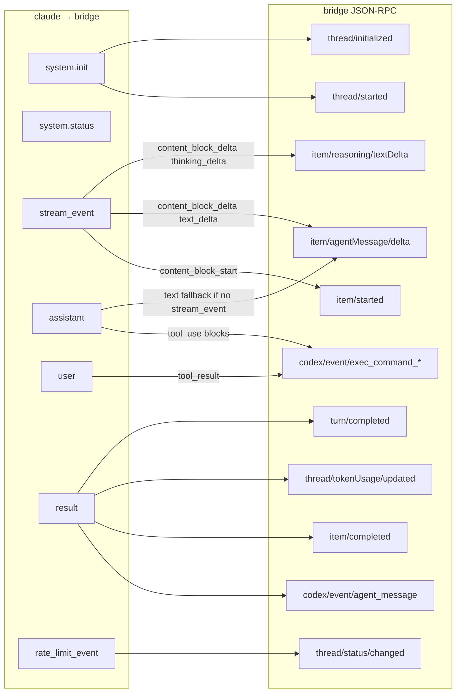

# Provider: Claude Code

Wraps Anthropic's `claude` CLI in `--print` mode. The CLI accepts JSON frames on stdin and emits JSON frames on stdout — Anthropic calls this "stream-json." A translator shim converts to/from Codex JSON-RPC.

| | |
|---|---|
| **CLI** | `claude --print --input-format stream-json --output-format stream-json --include-partial-messages --verbose` |
| **Home dir** | `~/.claude/` (env override: `CLAUDE_HOME`) |
| **Sessions dir** | `~/.claude/projects/` |
| **Translator** | `agnt-bridge/src/providers/claude/translate.js` |
| **Source** | `agnt-bridge/src/providers/claude/` |

## Capabilities

`plan: ✓ | fastMode: ✗ | subagents: ✓ | steerActiveTurn: ✗ | queueFollowup: ✗ | reasoningDeltas: ✓ | desktopRefresher: ✗ | rolloutMirror: ✗`

## Why long-lived stdin

Claude's `--print` mode accepts multiple `{type:"user",...}` lines on stdin and emits one `result` per turn while staying alive. EOF causes a clean exit. So the agnt transport spawns the CLI once and writes a new `{type:"user",...}` frame for each `turn/start`.

Compare with Cursor: Cursor's `cursor-agent -p` requires the prompt as a CLI argument and spawns fresh per turn. Claude's stdin frame protocol is what enables long-lived processes here.

## Stream-json frame mapping



Three notable details:

- **`stream_event` is authoritative.** When run with `--include-partial-messages`, Claude emits per-token `stream_event` frames. The shim uses these as the primary delta source. The consolidated `assistant` frame (which arrives after a message completes) is treated as a *fallback* — it only forwards text when no `stream_event` deltas have already covered it.
- **Tool calls come from `assistant`, not `stream_event`.** The `stream_event.input_json_delta` frames are fragmentary JSON — the shim doesn't try to parse them. Instead it waits for the consolidated `assistant` frame which has the parsed `tool_use.input` object, and emits `codex/event/exec_command_begin` from there.
- **Reasoning deltas.** `content_block_delta.thinking_delta` becomes `item/reasoning/textDelta` so iOS renders the "Thinking…" bubble.

## Tool dispatch

Claude has named tools (Bash, Read, Write, Edit, Glob, Grep, WebFetch, WebSearch, NotebookEdit, …). The shim maps them onto Codex JSON-RPC item types:

| Claude tool | Bridge item type | Notes |
|---|---|---|
| `Bash` | `codex/event/exec_command_*` family | shell command + cwd |
| `Read`, `Glob`, `Grep` | `file_read` / `tool_call` | one-shot read |
| `Write`, `Edit`, `NotebookEdit` | `file_change` | follow-up `tool_result` carries the output |
| anything else | `background_event` | best-effort label so iOS shows *something* |

Each tool's `tool_use_id` is tracked in the shim's `pendingToolCalls` map so the matching `tool_result` (from a subsequent `user` frame) can be paired up and emitted as `exec_command_end` / `item/completed`.

## Per-turn flag mapping

The shim translates `turn/start.params` into CLI flags:

| iOS param | Claude flag | Notes |
|---|---|---|
| `model` / `modelId` | `--model X` | passes through |
| `effort` (`minimal`/`low`/`medium`/`high`/`xhigh`/`max`) | `--effort Y` | mapped via `mapCodexEffortToClaude()` — `minimal` → `low` |
| `collaborationMode.mode === "plan"` | `--permission-mode plan` | enables structured plan mode |
| `permissionMode` (any) | `--permission-mode Z` | direct passthrough if valid |
| (default) | `--permission-mode acceptEdits` | the safe default in `--print` |

When the arg list changes mid-conversation, the transport `SIGTERM`s the running CLI and respawns with `--resume <session_id>` — so flag changes don't lose history.

## Approvals

There is no runtime approval channel in Claude `--print` mode. Without `--permission-mode acceptEdits`, the CLI would block forever waiting for a TTY prompt that doesn't exist.

The shim defaults to `acceptEdits` so file edits flow without blocking. iOS can override per turn with `params.permissionMode` — for example `default` (no auto-accept, but you'll hang) or `bypassPermissions` (auto-accept everything including shell). The full set: `acceptEdits | auto | bypassPermissions | default | dontAsk | plan`.

## Soft interrupt + respawn

`turn/interrupt` does **not** kill the CLI permanently. Instead:

1. The shim emits synthetic `turn/failed` + `turn/completed` frames so the iOS UI exits the spinner.
2. `transport.interruptTurn()` sends `SIGINT` to the child and drops the reference.
3. The next `send()` (i.e. the next `turn/start`) lazily respawns with `--resume <session_id>` so the conversation continues seamlessly.

The "auto-respawn" path is silent — the bridge core only sees the original `started` event from spawn #1. Subsequent respawns don't emit new `started` events.

## Thread reconstruction from disk

Claude writes session history to `~/.claude/projects/<encoded-cwd>/<session-id>.jsonl`. When iOS asks for `thread/read` or `thread/turns/list`, the shim reads the matching file and reconstructs the turn list from `{type:"user"}` and `{type:"assistant"}` entries:

```js
function reconstructThreadFromRollout(targetThreadId) {
  const sessionFile = locateSessionFile(targetThreadId);
  // ...replay user/assistant pairs into Turn shapes
}
```

Source: `providers/claude/translate.js`. There's no separate fallback like the Codex JSONL fallback — Claude's translator handles `thread/turns/list` synthesis directly.

## Provider plugin file map

```
agnt-bridge/src/providers/claude/
├── index.js                 # defineProvider({...}) registration
├── transport.js             # Long-lived spawn + soft interrupt + auto-respawn
├── translate.js             # stream-json ↔ Codex JSON-RPC shim
└── detect.js                # `which claude` / Homebrew / npm-global discovery
```

## See also

- [`../architecture/translator-shim.md`](../architecture/translator-shim.md) — Pattern A (long-lived stdin)
- `agnt-bridge/test/claude-translate.test.js` — translator behavior tests
- `agnt-bridge/test/claude-transport.test.js` — transport / respawn tests
