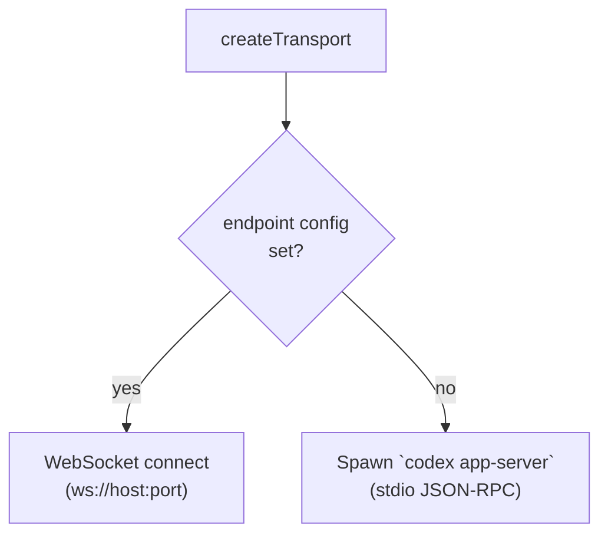

# Provider: Codex

The native provider. Codex's `app-server` already speaks Codex JSON-RPC, so there's no translator shim. The bridge just spawns or connects to it and relays frames in both directions.

| | |
|---|---|
| **CLI** | `codex app-server` |
| **Home dir** | `~/.codex/` (env override: `CODEX_HOME`) |
| **Sessions dir** | `~/.codex/sessions/` |
| **Translator** | none (native) |
| **Source** | `agnt-bridge/src/providers/codex/` |

## Capabilities

`plan: ✓ | fastMode: ✓ | subagents: ✓ | steerActiveTurn: ✓ | queueFollowup: ✓ | reasoningDeltas: ✓ | desktopRefresher: ✓ | rolloutMirror: ✓`

Codex is the only provider with `rolloutMirror: true` and `desktopRefresher: true` because the rollout-watcher and the Codex.app companion mirror both depend on Codex's specific rollout file format.

## Transport

Two modes, selected by what's available:



- **Spawn mode** (default): `codex app-server` is launched with stdin/stdout pipes. JSON-RPC frames are line-delimited.
- **WebSocket mode**: when `AGNT_CODEX_ENDPOINT` is set (or `--codex-endpoint`), the bridge connects to an existing `app-server` instead of spawning. Useful for local development.

Implementation: `agnt-bridge/src/providers/codex/transport.js`.

## Per-chat runtime controls

On a compatible local bridge, the iOS composer keeps model, reasoning, and speed
choices per chat. Settings are applied to the task's current runtime owner and
acknowledged before the next message is sent. Desktop edits flow back to the
phone; pending phone edits survive reconnects. A rejected edit remains visible
and blocks sending until it can be applied.

Speed options come from the model catalog. Normal explicitly resets speed;
an existing chat without a confirmed speed choice inherits its owner's setting.
Settings defaults still apply when creating chats. These synchronization RPCs
are Codex-specific; other providers retain their per-turn controls.

## Account / auth

Codex uses ChatGPT account auth. The bridge hosts these RPCs and forwards them through the secure transport:

| Method | Direction | What it does |
|---|---|---|
| `account/status/read` | iOS → bridge | Reads the current ChatGPT auth status from Codex's local state |
| `getAuthStatus` | iOS → bridge | Legacy alias |
| `account/login/start` | iOS → bridge → Codex | Initiates a fresh login flow |
| `account/login/cancel` | iOS → bridge → Codex | Aborts an in-flight login |
| `account/login/openOnMac` | iOS → bridge | Opens the login URL in the Mac's default browser |
| `account/logout` | iOS → bridge → Codex | Logs out |
| `account/login/completed` | Codex → iOS (notification) | Fires when login succeeds |
| `voice/transcribe` | iOS → bridge → ChatGPT | Voice-to-text using the Mac-resident ChatGPT token |
| `voice/resolveAuth` | iOS → bridge | Returns whether voice transcription is available |

Every one of these is gated on `activeProvider.id === "codex"` in `bridge.js`. Non-Codex providers either get a synthetic "managed externally" response or a JSON-RPC `-32601` rejection. Don't add new ChatGPT-token-bearing calls without that gate.

## Desktop refresher

If you have the macOS Codex.app installed, the bridge can watch for thread state changes and "refresh" the desktop app so terminal-side and phone-side stay in sync. This is gated on `capabilities.desktopRefresher === true` and only fires when the user has a recent enough Codex.app build.

Implementation: `agnt-bridge/src/providers/codex/desktop-refresher.js`. The agnt env var `AGNT_REFRESH_ENABLED` can disable this if you don't want the bridge poking the desktop app.

## Rollout mirror

Separate from the desktop refresher: the **rollout live mirror** (`agnt-bridge/src/rollout-live-mirror.js`) tails Codex's rollout JSONL file so iOS can render terminal-side activity in real time. Codex writes rollouts as the user types in the terminal app; agnt's bridge reads them and emits synthetic JSON-RPC notifications to the phone.

Local Desktop IPC also follows active Desktop-owned conversations. Rollout mirroring provides a file-backed recovery path. Both mechanisms are Codex-only: other providers do not have an equivalent companion desktop app.

The schema parsed:

| Entry type | Fields | Bridge handling |
|---|---|---|
| `session_meta` | `payload.id`, `cwd`, timestamps | establishes the rollout's threadId binding |
| `event_msg` (`task_started`) | `turn_id`, timestamp | starts a turn entry |
| `event_msg` (`task_complete`) | `turn_id` | marks the turn `completed` |
| `event_msg` (`user_message`) | `message`, `turn_id` | adds a user-role item |
| `event_msg` (`agent_message`) | streaming text | **ignored** — final text comes via `response_item` |
| `response_item` | `type`, `content`, `turn_id` | normalizes types (`functionCall` → `tool_call`) and adds to current turn |

This same schema is what `providers/codex/session-jsonl-history.js` parses for the empty-`thread/turns/list` fallback (see [`../architecture/adaptive-pager.md`](../architecture/adaptive-pager.md)). The diagnostic CLI `agnt-jsonl-diagnose` parses the same format.

## Bootstrap

Codex's CLI is bootstrapped via npm. `agnt-bridge/src/providers/codex/cli-bootstrap.js` runs as a postinstall step and ensures the `codex` binary is on PATH. If it isn't and the user wants Codex, the bridge prints install instructions and `isInstalled()` returns false.

## Title generation

Codex has a structured `thread/generateTitle` RPC. The bridge intercepts it in `git-handler.js` and forwards it only when `activeProvider.id === "codex"`. Other providers' translators handle title generation locally with deterministic seed-based logic.

## Provider plugin file map

```
agnt-bridge/src/providers/codex/
├── index.js                       # defineProvider({...}) registration
├── transport.js                   # spawn / WebSocket transport
├── home.js                        # ~/.codex resolution
├── cli-bootstrap.js               # npm-postinstall codex install nudge
├── desktop-refresher.js           # Debounced Codex.app refresh
├── session-jsonl-history.js       # Codex rollout parser (empty-list fallback)
└── scripts/                       # CLI bootstrap helpers
```

## See also

- [`../architecture/adaptive-pager.md`](../architecture/adaptive-pager.md) — how the Codex JSONL fallback fits into `thread/turns/list`
- [`../operations/debugging.md`](../operations/debugging.md) — `agnt-jsonl-diagnose` for inspecting rollout files
