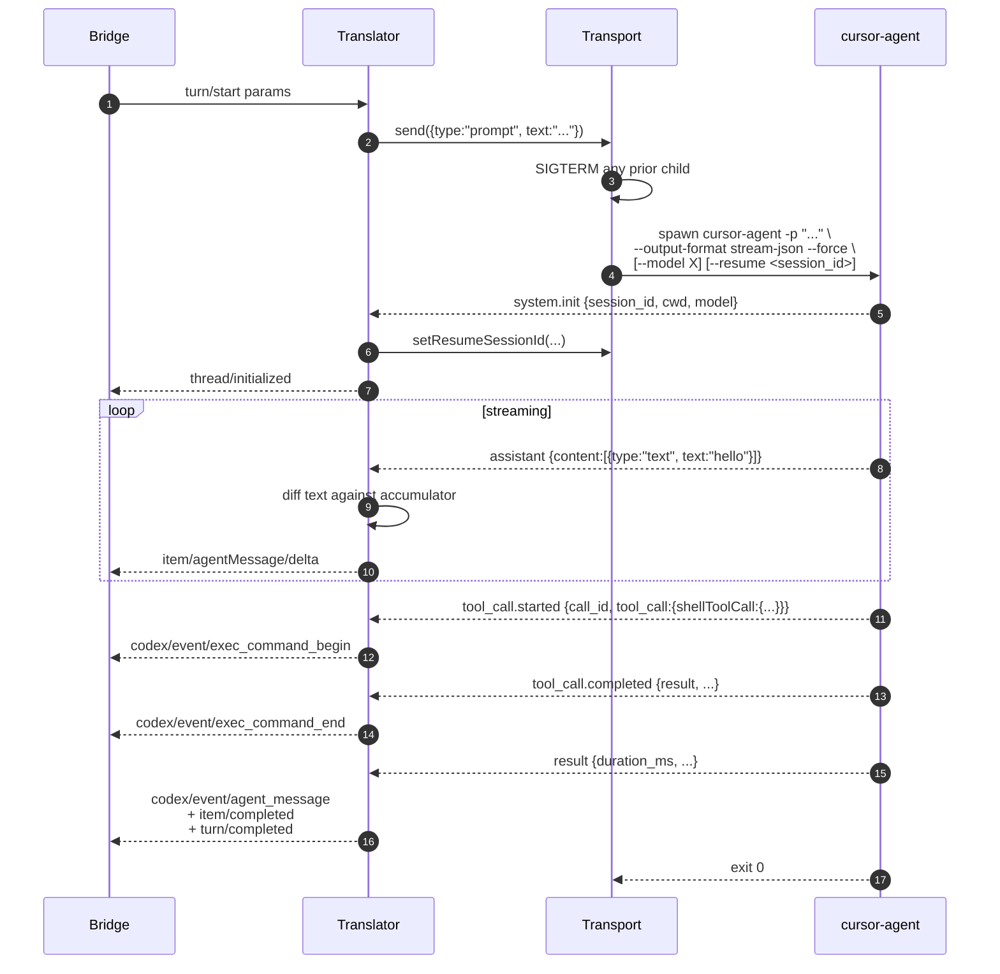
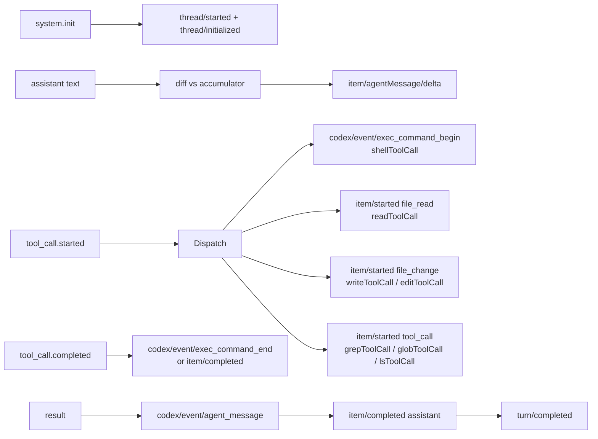

# Provider: Cursor

Cursor's `cursor-agent` CLI is the newest provider. Two things make it structurally different from Claude and opencode:

1. **Spawn-per-turn**, not long-lived. `cursor-agent` only accepts the prompt as a CLI argument — there's no stdin frame mode like Claude has.
2. **No runtime approval channel.** The shim hard-codes `--force` (auto-approve) for headless mode.

| | |
|---|---|
| **CLI** | `cursor-agent -p <prompt> --output-format stream-json --force [--model X] [--resume <session_id>]` |
| **Home dir** | `~/.cursor/` (env override: `CURSOR_HOME`) |
| **Sessions dir** | `~/.cursor/chats/` |
| **Translator** | `agnt-bridge/src/providers/cursor/translate.js` |
| **Source** | `agnt-bridge/src/providers/cursor/` |

## Capabilities

`plan: ✗ | fastMode: ✗ | subagents: ✗ | steerActiveTurn: ✗ | queueFollowup: ✗ | reasoningDeltas: ✗ | desktopRefresher: ✗ | rolloutMirror: ✗`

Notably no `reasoningDeltas` — the stream-json output doesn't expose separate thinking deltas.

## Spawn-per-turn lifecycle



Continuity across turns comes from `--resume`. The translator mirrors `session_id` from every incoming frame to `transport.setResumeSessionId()` so the next spawn picks up history.

Don't try to repurpose the Claude long-lived-stdin pattern here — `cursor-agent` doesn't support it.

## Custom transport envelope

The translator uses a custom envelope to communicate with the transport, since standard JSON-RPC doesn't have a "spawn with this prompt" semantic:

```js
// In translate.js handleTurnStart:
return [JSON.stringify({ type: "prompt", text: promptText })];

// In transport.js send():
const parsed = safeParseJson(message);
const promptText = readString(parsed?.text);
if (!promptText) return;        // not a prompt frame
shutdownChild(child);
spawnChild(promptText);
```

This keeps the transport mechanical (just spawns) and the translator semantic (decides when to spawn). It also means the cursor transport intentionally **drops** anything that isn't a `{type:"prompt"}` frame — Claude-style `{type:"user"}` lines never reach the CLI because the translator has already converted them.

## stream-json frame mapping



## Tool dispatch

cursor's `tool_call` frames carry a discriminated union — exactly one of these keys is set:

| `tool_call.<key>` | Args | Bridge mapping |
|---|---|---|
| `readToolCall` | `path`, optional `offset`, `limit` | `item/started` (`type: file_read`) |
| `writeToolCall` | `path`, `fileText` | `item/started` (`type: file_change`) |
| `editToolCall` | `path` | `item/started` (`type: file_change`) |
| `shellToolCall` | `command`, `cwd` | `codex/event/exec_command_begin` |
| `grepToolCall` | `pattern`, `path` | `item/started` (`type: tool_call`, `tool: "grep"`) |
| `globToolCall` | `globPattern`, `targetDirectory` | `item/started` (`type: tool_call`, `tool: "glob"`) |
| `lsToolCall` | `path` | `item/started` (`type: tool_call`, `tool: "ls"`) |
| `function` | name + args | `codex/event/background_event` |

Source of truth: `describeToolCall()` in `providers/cursor/translate.js`.

## Cumulative-snapshot deltas

Cursor emits assistant frames as cumulative snapshots — each frame's text contains everything previously sent plus the new chunk. The translator slices off the running accumulator to produce stable per-frame deltas:

```js
let delta = text;
if (assistantTextAccumulator && text.startsWith(assistantTextAccumulator)) {
  delta = text.slice(assistantTextAccumulator.length);
}
// emit delta to bridge
assistantTextAccumulator = text;
```

If the snapshot doesn't start with the previous accumulator (model rewrote something), the translator treats the whole frame as a new delta — losing a pretty rendering once is better than dropping content silently.

## Approvals — there aren't any

The CLI requires `--force` to skip per-tool TTY prompts. iOS has no per-call control. If you don't want auto-approve, don't use Cursor.

This is documented as a known limitation; `params.permissionMode` is silently ignored.

## Per-turn flags

```js
function publishTurnArgsForParams(params) {
  const args = [];
  const model = readString(params?.model)
    || readString(params?.modelId)
    || readString(params?.modelID);
  if (model) args.push("--model", model);
  transport.setTurnArgs(args);
}
```

Only `--model` today. Stored for the next spawn (cursor spawns fresh each turn, so the new args take effect immediately without a respawn-with-resume dance).

## Session continuity + thread reconstruction

Sessions persist as JSONL under `~/.cursor/chats/<session-id>.jsonl`. The shim's `thread/turns/list` and `thread/read` synthesize responses from these files (similar to Claude's reconstruction path).

## Concurrent-turn safety

Same `-32003` rejection as the other shims:

```js
if (activeTurnId) {
  respondError(request?.id, -32003, "A turn is already in flight on this thread");
  return null;
}
```

## Provider plugin file map

```
agnt-bridge/src/providers/cursor/
├── index.js                 # defineProvider({...}) registration
├── transport.js             # spawn-per-turn + soft-interrupt SIGINT
├── translate.js             # stream-json ↔ Codex JSON-RPC shim
└── detect.js                # `which cursor-agent` / `~/.local/bin` / `~/.cursor/bin`
```

## See also

- [`../architecture/translator-shim.md`](../architecture/translator-shim.md) — Pattern C (spawn-per-turn)
- `agnt-bridge/test/cursor-translate.test.js` — translator behavior tests (20 cases)
- [Cursor CLI docs](https://cursor.com/docs/cli/installation)
