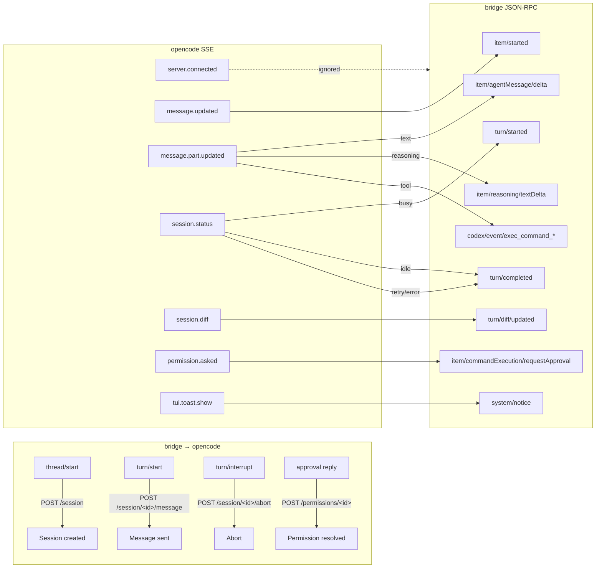

# Provider: opencode

opencode is a local HTTP server you `POST` to. State lives inside opencode itself; the shim is mostly a thin REST/SSE adapter to Codex JSON-RPC. It's the only non-Codex provider that supports **runtime tool approvals** — iOS can accept or decline tool calls per-call.

| | |
|---|---|
| **CLI** | `opencode serve` (HTTP + SSE) |
| **Home dir** | `$XDG_DATA_HOME/opencode` or `~/.local/share/opencode/` (env override: `OPENCODE_HOME`) |
| **Sessions dir** | `<home>/sessions/` |
| **Translator** | `agnt-bridge/src/providers/opencode/translate.js` |
| **Source** | `agnt-bridge/src/providers/opencode/` |

## Capabilities

`plan: ✗ | fastMode: ✗ | subagents: ✗ | steerActiveTurn: ✗ | queueFollowup: ✗ | reasoningDeltas: ✓ | desktopRefresher: ✗ | rolloutMirror: ✗`

## Wire mapping



## Threading model

opencode has no native "turn" concept — a session simply alternates user and assistant messages and reports `busy` / `idle`. The shim **synthesizes** a `turnId` per user-initiated `turn/start` and fires `turn/completed` on the next `idle` transition.

The mapping `bridge.threadId === opencode.session.id`. State held in the shim:

- `activeThreadId` — current session.
- `activeTurnId` — synthesized per turn.
- `activeAssistantMessageId` — the message id we're currently streaming.
- `partItemIds` — opencode message-part id → bridge item id, so deltas route to the same row.
- `toolCallById` — opencode tool-part id → `{toolName, command, cwd}` for completion routing.
- `approvalIdToPermission` — bridge JSON-RPC approval request id → opencode permissionID.
- `lastTokenSnapshot` — most recent usage from `message.updated`.

## Approval flow

This is opencode's distinguishing feature.

```mermaid
sequenceDiagram
    autonumber
    participant Opencode
    participant Shim as opencode shim
    participant iOS

    Opencode-->>Shim: SSE permission.asked<br/>{permissionID, type, command, ...}
    Shim->>Shim: store approvalIdToPermission[reqId] = permissionID
    Shim->>iOS: item/commandExecution/requestApproval<br/>(or item/fileChange/requestApproval)<br/>{id: reqId, params: {...}}
    iOS->>iOS: present sheet
    iOS-->>Shim: response {decision: "accept"|"decline"}
    Shim->>Shim: lookup permissionID from reqId
    Shim->>Opencode: POST /session/&lt;id&gt;/permissions/&lt;permissionID&gt;<br/>{response: "once"|"reject"}
    Opencode-->>Shim: SSE message.part.updated<br/>(tool resumes or aborts)
```

The mapping `accept → "once"`, `decline → "reject"`. There's no "always accept" — every call requires explicit user input. (iOS displays the command, file path, or content snippet in the sheet so the user can decide.)

For commands like `bash`, `read`, `write`, `edit`, the shim uses `item/commandExecution/requestApproval`. For patches/edits with multi-file diffs it uses `item/fileChange/requestApproval`. iOS renders different UI for each.

## System notices (toasts)

opencode emits `tui.toast.show` SSE events for things like "MCP server X failed to authenticate." The shim forwards these as `system/notice` JSON-RPC notifications so iOS can surface them — without this, MCP-auth issues would silently dropped and users would just see tools failing for no apparent reason.

## Tools

Since opencode doesn't advertise its tools in `system.init`, the shim emits a default tool list in the `thread/initialized` notification:

```
bash, read, write, edit, glob, grep, task, todowrite, webfetch, websearch
```

iOS uses this to populate the slash-commands and skills UI. If opencode adds new tools, this list lags until the shim is updated.

## Compact + fork

Two opencode-specific RPCs the shim translates:

| Bridge RPC | opencode endpoint | What it does |
|---|---|---|
| `thread/compact/start` | `POST /session/<id>/compact` | Compresses long history into a summary so context fits |
| `thread/fork/start` | `POST /session/<id>/fork` | Branches the conversation from a specific turn |

Both are real (unlike Claude/Cursor where `thread/compact` returns `{compacted:false, reason: "..._cli_compact_unsupported"}`).

## Per-turn flags

opencode reads model/provider/agent from the request body, not CLI flags. The shim publishes them via `turn/start.params` → `POST /session/<id>/message` body fields:

```
{
  "providerID": params.providerId,
  "modelID": params.model,
  "agent": params.agent,
  "parts": [{ "type": "text", "text": "..." }, ...]
}
```

Compare with Claude where `model` translates to a CLI flag and triggers a respawn. opencode's stateful HTTP server doesn't need that — every message includes its own model.

## Concurrent-turn safety

The shim rejects a second `turn/start` while one is in flight:

```js
if (activeTurnId) {
  respondError(request?.id, -32003, "A turn is already in flight on this thread");
  return null;
}
```

opencode itself is also stateful and would reject the duplicate request, but doing it in the shim avoids the round-trip.

## Provider plugin file map

```
agnt-bridge/src/providers/opencode/
├── index.js                 # defineProvider({...}) registration
├── transport.js             # spawn `opencode serve` + HTTP client + SSE pump
├── translate.js             # REST/SSE ↔ Codex JSON-RPC shim
└── detect.js                # `which opencode` / Homebrew / `~/.bun` discovery
```

## See also

- [`../architecture/translator-shim.md`](../architecture/translator-shim.md) — Pattern B (REST + SSE)
- `agnt-bridge/test/opencode-translate.test.js` — translator behavior tests
- [opencode docs](https://opencode.ai)
