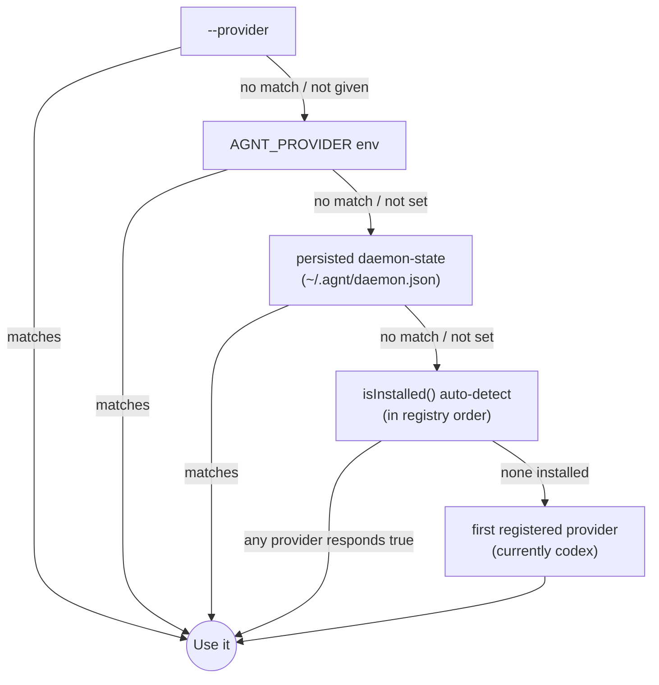

# Providers — overview

A "provider" is the integration point between the bridge core and a specific agent CLI. agnt ships with four:

| Provider | CLI | Native protocol | Translator? | Spawn model |
|---|---|---|---|---|
| [Codex](codex.md) | `codex app-server` | Codex JSON-RPC | none (native) | long-lived stdio + WebSocket |
| [Claude Code](claude.md) | `claude --print` | stream-json | yes | long-lived stdin frame stream |
| [opencode](opencode.md) | `opencode serve` | REST + SSE | yes | local HTTP server |
| [Cursor](cursor.md) | `cursor-agent -p` | stream-json | yes | spawn-per-turn |

The contract every provider implements is in [`../architecture/provider-contract.md`](../architecture/provider-contract.md). The translation patterns the three non-native providers use are in [`../architecture/translator-shim.md`](../architecture/translator-shim.md).

## Capability matrix

| Flag | Codex | Claude | opencode | Cursor |
|---|---|---|---|---|
| `plan` | ✓ | ✓ | ✗ | ✗ |
| `fastMode` | ✓ | ✗ | ✗ | ✗ |
| `subagents` | ✓ | ✓ | ✗ | ✗ |
| `steerActiveTurn` | ✓ | ✗ | ✗ | ✗ |
| `queueFollowup` | ✓ | ✗ | ✗ | ✗ |
| `reasoningDeltas` | ✓ | ✓ | ✓ | ✗ |
| `desktopRefresher` | ✓ | ✗ | ✗ | ✗ |
| `rolloutMirror` | ✓ | ✗ | ✗ | ✗ |

`rolloutMirror: true` is **Codex-only**. It gates the desktop-companion mirror that tails the macOS Codex desktop app's rollout file so iOS can mirror the user's terminal-side chat live. The other providers have no equivalent companion app.

## Approval handling

| Provider | Runtime channel | Default |
|---|---|---|
| Codex | yes (native `requestApproval`) | iOS prompts the user per call |
| Claude | none (no TTY in `--print`) | hard-coded `--permission-mode acceptEdits` |
| opencode | yes (SSE `permission.asked` → JSON-RPC `requestApproval`) | iOS prompts the user per call |
| Cursor | none (no headless approval API) | hard-coded `--force` (auto-approve) |

For Claude and Cursor, the iOS user has no per-call control — file edits and shell calls happen as the agent decides. iOS can override Claude's `permissionMode` per turn via `params.permissionMode`. Cursor has no override.

## Selection precedence

The registry order in `agnt-bridge/src/providers/index.js` is `[codex, claude, opencode, cursor]` — that's the default fallback if nothing else matches. Source: `agnt-bridge/src/providers/index.js`.

## Choosing a provider

Quick sanity guide:

- **Codex**: most feature-rich, only one with the desktop-companion mirror, native account/login flow. Default if you have a ChatGPT subscription.
- **Claude Code**: Anthropic's CLI. Gets reasoning deltas, plan mode, and subagents. Local file edits via `acceptEdits` mode.
- **opencode**: open agent runtime. The only non-Codex provider with **runtime tool approvals** (per-call accept/decline from your phone).
- **Cursor**: Cursor's `cursor-agent` CLI. Spawn-per-turn means cleaner shutdown semantics, but no runtime approval control and no reasoning deltas.

If you don't know what to pick, start with Codex (auto-detect prefers it because it's first in the registry).

## Per-provider deep-dives

- [`codex.md`](codex.md)
- [`claude.md`](claude.md)
- [`opencode.md`](opencode.md)
- [`cursor.md`](cursor.md)
